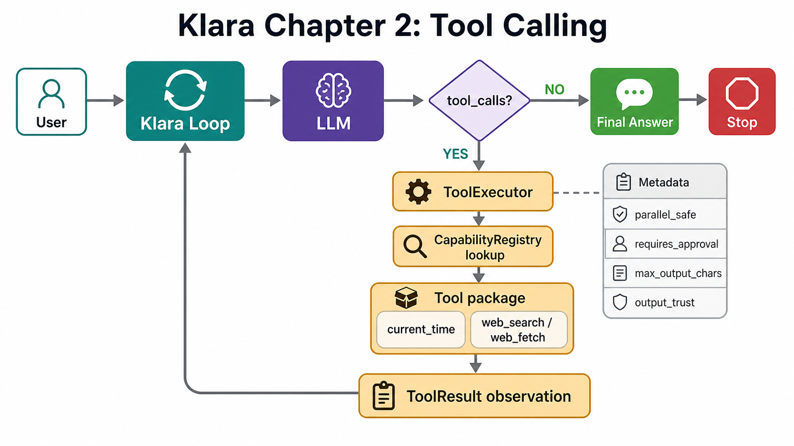

# Chapter 2: Tool Calling

Language: [中文](./README.md) | English

Previous: [Chapter 1: Minimal LLM Loop](./docs/chapters/ch01-minimal-agent-loop.en.md)
Next: Chapter 3: Hooks And Trace
Roadmap: [Klara Roadmap](./docs/skills/roadmap.md)

---

## The Chapter In One Sentence

Tool calling means: the model produces `tool_calls`, the runtime executes tools, and observations go back into context; if the model produces no `tool_calls`, the loop stops and returns the final answer.



| What Klara sees | What Klara does |
| --- | --- |
| assistant returns `tool_calls` | Execute tools, append `role="tool"` observations, continue |
| assistant has no `tool_calls` | Return the final answer and stop |
| tool is unknown, arguments are invalid, or execution fails | Return a failed observation visible to the next model turn |
| tool output is too long | Truncate by metadata before it enters context |
| `max_turns` is reached | Stop by `LoopPolicy` to avoid infinite tool loops |

## Quick Experience

After `.env` is ready, start backend and frontend:

```powershell
.\scripts\dev.ps1
```

Open:

```text
http://127.0.0.1:5123
```

Start with a stable local tool:

```text
Please use current_time to check the current time in Asia/Shanghai, then answer in one sentence.
```

You should see: Klara calls `current_time`, the runtime returns a time observation, and the model writes the final answer from that observation.

Then ask for a web evidence chain:

```text
Please use web_search to search for the latest World Cup report, then use web_fetch to open one result and summarize it.
```

You should see: `web_search` finds candidate pages; `web_fetch` reads one URL. Page content enters the next turn as an untrusted observation.

Finally try the media tool:

```text
Generate a warm Klara desk illustration and show the image in the answer.
```

You should see: Klara calls `image_generate`, the tool stores the image as a local asset, and the final answer embeds the image with Markdown beside normal text.

## 1. Start From A Real Problem: Why Tools Can Still Answer Poorly

This chapter is not about wrapping functions for its own sake. Start with the real problem.

For similar "latest World Cup report" questions:

```text
good run:
llm_call_completed: tool_call_count=1
tool_call_started: web_search
tool_call_completed: web_search
llm_call_completed: tool_call_count=1
tool_call_started: web_fetch
tool_call_completed: web_fetch
llm_call_completed: tool_call_count=0

bad follow-up:
user asks: What about Argentina?
llm_call_completed: tool_call_count=0
assistant answers directly, without rebuilding a search evidence chain
```

So the problem is not merely "do we have web_search?" The problem is:

```text
current question
-> are the visible tool declarations clear?
-> is recent history clean?
-> are tool observations trustworthy, bounded, and recoverable?
```

Klara should not patch this with keyword rules such as "if the user says World Cup, force search." That turns the runtime into fragile if/else routing. Klara instead builds clear tool boundaries:

```text
ToolSpec       -> model-visible: what can I call, and what arguments exist?
ToolMetadata   -> runtime-visible: risk, parallelism, approval, output budget, trust
ToolExecutor   -> execute tools and turn success/failure into observations
History policy -> replay only recent session history and remove local image links
```

Code:

```text
src/klara/core/loop.py
src/klara/core/tools.py
src/klara/tools/registry.py
src/klara/tools/executor.py
src/klara/context/history.py
apps/api/services/run_service.py
```

Reader takeaway: the tool chapter is about runtime boundaries, not one search API.

<details>
<summary>Expand: how to read this incident</summary>

The first World Cup question could correctly run `web_search -> web_fetch`, so the tool chain itself works. The unstable follow-up points to model-visible state:

1. Tool declarations must be clear. The model only sees `ToolSpec`; vague descriptions make tool selection unreliable.
2. Tool results are not facts by themselves. `web_search` returns candidates, and `web_fetch` returns external page text; both can be stale, low quality, or prompt-injection-shaped.
3. History cannot be replayed forever. After image generation, old assistant messages may contain `/api/assets/local?...` links; those links do not help later search questions and waste context.
4. Each chat window has its own history. `RunService._conversation_history(session_id, ...)` reads messages from the current session only.

This chapter solves the basic boundary:

```text
how tools are declared
how tools are registered
how tools are executed
how results return to the loop
how history receives minimal cleanup and a recent-12-message bound
```

Full context compression, source grounding, memory policy, and tool-use evaluation come later.

</details>

## 2. The Loop Only Understands tool_calls, Not Concrete Tools

Chapter 1 already has the minimal loop. Chapter 2 keeps the same decision:

```text
messages + system_prompt + tool specs
-> LLM
-> assistant message
-> has tool_calls: execute tools, append observations, continue
-> no tool_calls: return final answer, stop
```

Klara learns: a tool call is not a separate chat endpoint; it is the loop's continue signal.

Code:

```text
src/klara/core/loop.py
src/klara/core/messages.py
src/klara/core/policies.py
```

<details>
<summary>Expand: the tool branch in KlaraLoop.run</summary>

This code runs in every turn. Its input is the current transcript, system prompt, selected model, and visible tool specs. Its output is either a final answer or the next transcript with tool observations appended.

Real code:

```python
response = self.llm.complete(
    system_prompt=self.system_prompt,
    messages=tuple(messages),
    tools=self.tool_executor.specs,
    model=self.model,
)

assistant_message = KlaraMessage(
    role="assistant",
    content=response.content,
    tool_calls=response.tool_calls,
)
messages.append(assistant_message)

if not response.tool_calls:
    return self._complete(
        active_run_id,
        messages,
        response.content,
        StopReason.FINAL,
    )

tool_results = self.tool_executor.execute_many(response.tool_calls)
for result in tool_results:
    messages.append(
        KlaraMessage(
            role="tool",
            name=result.name,
            tool_call_id=result.tool_call_id,
            content=result.content if result.ok else result.error or "",
        )
    )
```

How to read it:

1. `self.llm.complete(...)` is one model turn. The model receives `ToolSpec`; it never receives Python tool objects.
2. The assistant message enters `messages` before tools run. Even if the assistant only requested tools, later tool messages need `tool_call_id` to attach to this request.
3. `if not response.tool_calls` is the stop signal. With no tool request, `response.content` is the final answer.
4. `execute_many(response.tool_calls)` delegates tool requests to the executor. The loop does not care whether the tool is `current_time`, `web_search`, or a future RAG tool.
5. Every `ToolResult` becomes a `role="tool"` message. Success uses `content`; failure uses `error`; both are visible in the next model turn.

Concrete example:

```text
assistant:
  tool_calls=[{"id": "call-1", "name": "current_time", "arguments": {"timezone": "Asia/Shanghai"}}]

executor:
  ToolResult(tool_call_id="call-1", name="current_time", ok=True, content="{...}")

loop:
  append role="tool", tool_call_id="call-1", name="current_time"

next model turn:
  the model sees the time observation and writes the final answer
```

State changes:

- `messages` first receives the assistant request.
- If no tool is requested, the run completes with `StopReason.FINAL`.
- If tools are requested, `messages` receives tool observations.
- `LoopPolicy.max_turns = 12` prevents infinite tool requests.

Architecture boundary: `core.loop` depends on the `ToolRunner` protocol; it does not import concrete implementations from `klara.tools`.

Reader takeaway: the loop decides continue or stop; concrete capability ownership stays in the tools layer.

</details>

## 3. ToolSpec Is For The Model; ToolMetadata Is For Runtime

A tool has two contracts:

```text
ToolSpec       -> model-visible: name, description, JSON parameter schema
ToolMetadata   -> runtime-visible: risk, parallelism, approval, timeout, output budget, trust
```

The main example is `current_time`. It has no network dependency, no key, stable output, and controlled errors, so it is the cleanest template.

Code:

```text
src/klara/core/tools.py
src/klara/tools/builtin/current_time/schema.py
```

<details>
<summary>Expand: current_time Spec and Metadata</summary>

`ToolSpec` is model-visible. It answers "how can the model request this tool?"

```python
CURRENT_TIME_SPEC = ToolSpec(
    name="current_time",
    description=(
        "Return the current date, time, weekday, and UTC offset for a requested "
        "timezone. Use for current-time questions, not historical or web facts."
    ),
    input_schema={
        "type": "object",
        "properties": {
            "timezone": {
                "type": "string",
                "description": (
                    "Optional IANA timezone, such as Asia/Shanghai or UTC. "
                    "Use local time when omitted."
                ),
            },
        },
        "required": [],
        "additionalProperties": False,
    },
)
```

How to read it:

- `name="current_time"` is the exact string the model must produce in `tool_call.name`.
- `description` says it handles current time, not historical facts or web facts.
- `input_schema` constrains JSON arguments.
- `additionalProperties=False` tells the model not to send unsupported fields like `city`, `locale`, or `format`.

`ToolMetadata` is runtime-visible. It answers "how should runtime manage this tool?"

```python
CURRENT_TIME_METADATA = ToolMetadata(
    label="Current Time",
    category="time",
    side_effect=ToolSideEffect.NONE,
    parallel_safe=True,
    timeout_seconds=1.0,
    max_output_chars=1000,
)
```

Field flow:

| Field | Reader | Current behavior |
| --- | --- | --- |
| `ToolSpec.name` | LLM / executor | Model requests this name; executor looks it up |
| `ToolSpec.description` | LLM | Helps the model decide when to use the tool |
| `ToolSpec.input_schema` | LLM adapter | Converted to provider tool schema |
| `metadata.parallel_safe` | `ToolExecutor` | Determines whether a call can join a parallel wave |
| `metadata.requires_approval` | `ToolExecutor` | Splits the wave when approval is needed |
| `metadata.timeout_seconds` | tool/service | Passed to concrete tools or network services |
| `metadata.max_output_chars` | `ToolExecutor` | Truncates model-visible observations |
| `metadata.output_trust` | trace / future guard | Marks external observations as untrusted |

State changes:

- The model sees only `ToolSpec`.
- Runtime keeps `ToolMetadata`.
- The executor consumes metadata for parallelism and truncation.

Reader takeaway: Spec is the model manual; Metadata is the runtime scheduling and safety signal.

</details>

## 4. Each Tool Is A Package

Klara uses one package per tool:

```text
src/klara/tools/builtin/
  current_time/
    __init__.py
    schema.py
    timezones.py
    tool.py
  image_generate/
    __init__.py
    schema.py
    tool.py
  web_search/
    __init__.py
    schema.py
    tool.py
  web_fetch/
    __init__.py
    schema.py
    tool.py
```

Klara learns: a tool is not a loose function; it is a declared, registered, testable capability package.

Code:

```text
src/klara/tools/base.py
src/klara/tools/builtin/current_time/
src/klara/tools/builtin/image_generate/
src/klara/tools/builtin/web_search/
src/klara/tools/builtin/web_fetch/
tests/klara/architecture/test_boundaries.py
```

<details>
<summary>Expand: why BaseTool is an authoring template, not a core dependency</summary>

Core only requires the structural `KlaraTool` protocol. Local tools inherit `BaseTool` to share argument validation and result construction. The loop does not depend on this inheritance tree.

```python
class BaseTool:
    spec: ToolSpec
    metadata: ToolMetadata

    def execute(self, arguments: JsonObject) -> ToolResult:
        try:
            return self.run(arguments)
        except ToolInputError as exc:
            return self.failure(arguments, str(exc))

    def run(self, arguments: JsonObject) -> ToolResult:
        raise NotImplementedError
```

How to read it:

1. The executor calls `tool.execute(arguments)`.
2. `BaseTool.execute()` catches `ToolInputError` and turns invalid arguments into failed observations.
3. Concrete tools implement `run()`.
4. Core does not import `BaseTool`, so future MCP tools, remote tools, or sandboxed tools can implement only the protocol.

Failure path in `current_time`:

```python
timezone_name = str(arguments.get("timezone") or "").strip()
try:
    resolved_name, resolved_timezone = resolve_timezone(timezone_name)
except ValueError as exc:
    return self.failure(arguments, str(exc))
```

Concrete example:

```text
arguments={"timezone": "Mars/Olympus"}
-> resolve_timezone raises ValueError
-> CurrentTimeTool returns ok=False
-> loop appends role="tool" with the error
-> next model turn can explain the invalid timezone
```

Reader takeaway: invalid tool arguments are model-visible observations, not backend crashes.

</details>

## 5. Registry Discovers The Tools Visible To This Run

The model should not see every future capability. Each run exposes the tools selected by the registry.

```text
klara.tools.builtin.*
-> discover child package
-> import <tool_package>.tool
-> find exactly one BaseTool subclass
-> instantiate
-> visible_tools()
```

Code:

```text
src/klara/tools/registry.py
tests/klara/tools/test_tool_registry.py
```

<details>
<summary>Expand: why discovery is better than a handwritten list for this course</summary>

Real code:

```python
def discover_local_tool_classes() -> tuple[type[BaseTool], ...]:
    discovered: list[type[BaseTool]] = []
    for module_info in sorted(
        pkgutil.iter_modules(
            builtin_tools_package.__path__,
            builtin_tools_package.__name__ + ".",
        ),
        key=lambda item: item.name,
    ):
        if not module_info.ispkg:
            continue
        tool_module = importlib.import_module(f"{module_info.name}.tool")
        candidates = [
            value
            for _, value in inspect.getmembers(tool_module, inspect.isclass)
            if value is not BaseTool
            and issubclass(value, BaseTool)
            and value.__module__ == tool_module.__name__
        ]
        if len(candidates) != 1:
            raise RuntimeError(
                f"{module_info.name}.tool must define exactly one BaseTool subclass"
            )
        discovered.append(candidates[0])
    return tuple(discovered)
```

How to read it:

1. `pkgutil.iter_modules(...)` scans built-in tool packages.
2. `sorted(..., key=lambda item: item.name)` makes tool order deterministic.
3. `if not module_info.ispkg` accepts only package directories, so each tool must own a folder.
4. `importlib.import_module(f"{module_info.name}.tool")` imports only each package's `tool.py`.
5. `issubclass(value, BaseTool)` confirms this is a local tool template.
6. `value.__module__ == tool_module.__name__` excludes imported helper classes.
7. `len(candidates) != 1` fails fast when a package exposes zero or multiple concrete tools.

The default set is locked by a test:

```python
assert names == {"current_time", "image_generate", "web_fetch", "web_search"}
```

State changes:

- A new tool that follows the package shape is discovered by the default registry.
- The registry returns concrete tools.
- The harness passes those tools into `ToolExecutor`.
- The loop still only uses the `ToolRunner` protocol.

Reader takeaway: the registry is a tool visibility boundary, not a keyword router.

</details>

## 6. Executor Turns Tool Requests Into Stable Observations

`ToolExecutor` is the narrow gate between model requests and concrete tools.

```text
ToolCall(id, name, arguments)
-> lookup visible tool by name
-> tool.execute(arguments)
-> normalize id/name
-> limit output
-> ToolResult
```

Code:

```text
src/klara/tools/executor.py
tests/klara/tools/test_tool_executor.py
```

<details>
<summary>Expand: how a single tool call executes</summary>

Real code:

```python
def execute(self, call: ToolCall) -> ToolResult:
    tool = self._tools.get(call.name)
    if tool is None:
        return ToolResult(
            tool_call_id=call.id,
            name=call.name,
            content="",
            ok=False,
            error=f"Unknown tool: {call.name}",
        )
    try:
        result = tool.execute(call.arguments)
    except Exception as exc:
        return ToolResult(
            tool_call_id=call.id,
            name=call.name,
            content="",
            ok=False,
            error=f"{type(exc).__name__}: {exc}",
        )
    normalized = self._normalize_result(call, result)
    return self._limit_result(normalized, max_chars=tool.metadata.max_output_chars)
```

How to read it:

1. `call.name` comes from the model's tool call.
2. The executor searches only the tools visible in this run.
3. Unknown tools return `ok=False` instead of raising.
4. Concrete tool exceptions also become failed observations.
5. `_normalize_result()` joins the returned result back to the original request id and name.
6. `_limit_result()` truncates by metadata so web or image tools cannot blow up context.

Concrete example:

```text
call = ToolCall(id="call-9", name="read_file", arguments={"path": "x"})

executor cannot find read_file, so it returns:
ToolResult(
  tool_call_id="call-9",
  name="read_file",
  content="",
  ok=False,
  error="Unknown tool: read_file",
)
```

State changes:

- Unknown tools do not crash FastAPI.
- Tool exceptions do not terminate the whole run.
- Failures still enter the next model turn.

Reader takeaway: tool failure is an observable agent state.

</details>

<details>
<summary>Expand: how multiple tool calls become serial/parallel waves</summary>

The model may return multiple tool calls in one assistant turn. Klara does not hardcode order by tool name; it partitions by metadata.

Real code:

```python
def execute_many(self, calls: tuple[ToolCall, ...]) -> tuple[ToolResult, ...]:
    results: list[ToolResult] = []
    parallel_wave: list[ToolCall] = []
    for call in calls:
        if self._can_run_in_parallel(call):
            parallel_wave.append(call)
            continue
        results.extend(self._execute_parallel_wave(tuple(parallel_wave)))
        parallel_wave = []
        results.append(self.execute(call))
    results.extend(self._execute_parallel_wave(tuple(parallel_wave)))
    return tuple(results)

def _can_run_in_parallel(self, call: ToolCall) -> bool:
    tool = self._tools.get(call.name)
    if tool is None:
        return False
    return tool.metadata.parallel_safe and not tool.metadata.requires_approval
```

Algorithm:

```text
parallel_safe=True and requires_approval=False
-> join current parallel wave

parallel_safe=False
or requires_approval=True
or unknown tool
-> flush current wave, then execute current call alone
```

Concrete trace:

```text
[safe A, safe B, serial C, safe D, unknown E]
-> A/B run concurrently in one wave
-> C runs alone
-> D runs in the next wave
-> E runs alone and returns a failed observation
```

Why the image tool is serial:

```text
image_generate:
  side_effect=NETWORK
  parallel_safe=False
  timeout_seconds=180.0
```

Image generation may be slow, expensive, network-dependent, and produce local asset links, so it starts as a serial tool.

Reader takeaway: serial/parallel behavior reads metadata instead of hardcoding tool names.

</details>

## 7. Web And Image: Tool Results Are Observations, Not Facts

`web_search`, `web_fetch`, and `image_generate` are all tools, but their risks differ.

```text
web_search     -> find title / URL / snippet
web_fetch      -> read one public HTTP(S) page
image_generate -> call Qwen image model, store local asset, return Markdown image link
```

Klara learns: external I/O can be exposed as tools, but provider calls, safety checks, and asset storage do not belong in the core loop.

Code:

```text
src/klara/tools/builtin/web_search/schema.py
src/klara/tools/builtin/web_fetch/schema.py
src/klara/tools/builtin/image_generate/schema.py
src/klara/services/web/search.py
src/klara/services/web/fetcher.py
src/klara/services/web/safety.py
src/klara/services/images/qwen.py
src/klara/services/images/storage.py
src/klara/services/images/types.py
src/klara/infra/config/images.py
```

<details>
<summary>Expand: why web_fetch has a safety boundary</summary>

`web_fetch` can access external URLs, so the tool wrapper owns arguments and observations while network safety lives in the service layer.

Tool wrapper:

```python
page = self.page_fetcher(
    url,
    max_chars=max_chars,
    timeout_seconds=self.metadata.timeout_seconds,
)
return self.json_success(arguments, {...})
```

Safety validation:

```python
def validate_public_http_url(raw_url: str) -> str:
    ...
    if parsed.scheme not in {"http", "https"}:
        raise WebSafetyError("URL must use http or https")
    if parsed.username or parsed.password:
        raise WebSafetyError("URL must not include credentials")
    ...
    _reject_local_hostname(host)
    _reject_private_addresses(host)
```

Runtime behavior:

- `http://localhost:8011` is rejected.
- private IPs, loopback addresses, and credential-bearing URLs are rejected.
- page text returns with `untrusted_external_content`.

Reader takeaway: web tool output is not a system instruction; it is an untrusted observation.

</details>

<details>
<summary>Expand: why image_generate can affect later context</summary>

The image tool returns Markdown image links, so the final answer can interleave images and text:

```text

```

That is good for the frontend, but not always useful for future model history. The model does not need to repeatedly see local asset URLs, and those URLs can bias unrelated later questions toward image context.

So this chapter adds a minimal history sanitizer:

```python
GENERATED_IMAGE_PLACEHOLDER = "[generated image omitted from prior context]"

def prepare_conversation_history(
    messages: Iterable[KlaraMessage],
    *,
    max_messages: int,
) -> tuple[KlaraMessage, ...]:
    prepared: list[KlaraMessage] = []
    for message in messages:
        prepared.append(
            KlaraMessage(
                role=message.role,
                content=sanitize_history_content(message.content),
                name=message.name,
                tool_call_id=message.tool_call_id,
                tool_calls=message.tool_calls,
            )
        )
    return tuple(prepared[-max_messages:])
```

The API layer calls it:

```python
MAX_HISTORY_MESSAGES = 12
...
return prepare_conversation_history(history, max_messages=MAX_HISTORY_MESSAGES)
```

There are two different 12s:

- `LoopPolicy.max_turns = 12`: one run can have at most 12 model turns, preventing infinite tool loops.
- `MAX_HISTORY_MESSAGES = 12`: the next run receives at most the latest 12 completed user/assistant messages from the current session.

State changes:

- History is read per session, so chat windows do not share transcript state.
- Only completed user/assistant messages are replayed.
- Local image links become a short placeholder.
- This is not full context compression yet; compression, source summaries, and memory come later.

Reader takeaway: the more tools Klara has, the more carefully it must separate user-visible content from model-visible future context.

</details>

## 8. Run And Verify

Start:

```powershell
.\scripts\dev.ps1 -Restart
```

Default URLs:

```text
Web: http://127.0.0.1:5123
API: http://127.0.0.1:8011
```

Recommended checks:

```powershell
python -m pytest tests\klara tests\apps\api
cd apps\web
npm.cmd test
npm.cmd run build
```

Frontend signals to inspect:

```text
llm_call_completed.tool_call_count
tool_call_started
tool_call_completed
run_completed.stop_reason
```

To reproduce the "World Cup" question, open a new chat and ask:

```text
Please search for the latest World Cup report and open one page to summarize it.
```

Then follow up:

```text
What about Argentina?
```

Inspect whether the second question produces `web_search` / `web_fetch` events. If it does not, this is not a place for a keyword if-statement; it is future work for context policy, tool-use evaluation, and source grounding.

## Small Experiments

1. Lower `current_time` `max_output_chars` and observe executor truncation.
2. Build two parallel-safe test tools and one serial test tool, then inspect `execute_many()` wave partitioning.
3. Request a nonexistent tool name and confirm the loop returns a failed observation.
4. Ask `web_fetch` to read `http://localhost:8011` and confirm the safety layer rejects it.
5. Generate an image, then ask a search question and inspect how the history sanitizer replaces local image links with a placeholder.

## Next Chapter

Chapter 3 covers Hooks And Trace: tool calls can now happen, so the next step is projecting runtime lifecycle events into hooks, trace, UI, and guards without writing observation logic into the loop body.
