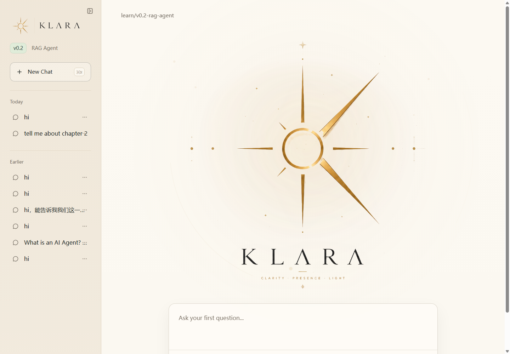
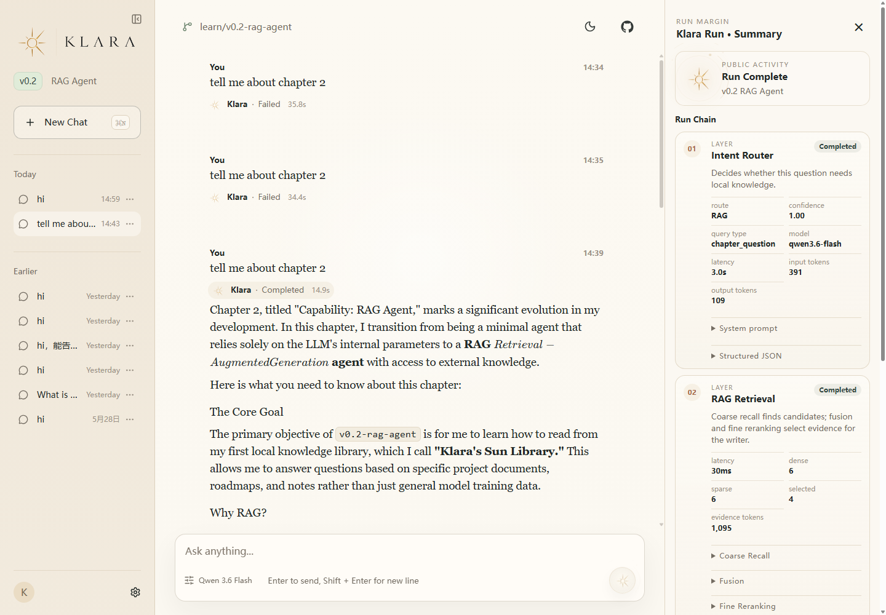

# 章节三：Agentic RAG，Klara 的受控研究运行时
> 从固定检索，到受控证据搜索

当前分支：`v0.3-agentic-rag`  
上一分支：`v0.2-rag-agent`

Chapter 3 把第二章的 fixed retrieve-and-answer RAG 升级为本地版 controlled evidence search runtime。Klara 不做自由 agent loop；runtime 拥有 workflow、budget、failure policy、trace 和 schema validation，worker 只通过 typed contracts 单次输入/输出。

## 如何运行 Chapter 3

```powershell
# 本地 fixture paper corpus 已在 data/papers/fixtures 中准备好
py -m agent_ladder.app.cli.main ask-agentic "给我 10 篇 Agentic RAG 相关论文，并按路线分类"
py -m agent_ladder.app.cli.main ask-agentic "Explain figure aware RAG in Chinese, include figure"

# 真实论文语料（如果已经运行 scripts/ingest/build_paper_corpus.py）
py -m agent_ladder.app.cli.main ask-agentic "给我 10 篇 Agentic RAG 相关论文，并按路线分类" --paper-root data/papers
```

输出包含：Question、Answer、Sources、Visual Sources、route、run_mode、search_units、retrieval_attempts、evidence_items、verification status、latency_ms、trace_saved。

## Chapter 3 前后端真实联调

```powershell
# 后端
.\.venv-win\Scripts\python.exe -m uvicorn apps.api.main:app --host 127.0.0.1 --port 8000

# 前端
cd apps\web
npm run dev -- --host 127.0.0.1 --port 5123
```

打开：

```text
http://127.0.0.1:5123
```

页面会调用真实 API `POST /api/runs`，显示 answer、sources、citations、visual sources、run info、search plan、retrieval attempts、EvidencePack summary 和 trace path。Visual source 如果有真实图片会走 `/api/assets/local?path=...` 安全预览；如果只有 caption/text placeholder，会显示 caption card，不伪造图片。

## 本章新增

- RequestSpec / LanguagePlan / AnswerRequirement
- EvidenceSearchPlan with search units and budgets
- SearchProvider / FetchProvider abstraction
- PaperCorpus fixture interface
- Multi-path retrieval + RRF fusion + paper-level dedup + diversity rerank
- Figure-aware caption retrieval
- EvidencePack writer boundary
- AnswerFrameV2
- Citation/Evidence/Visual/Language verification
- DecisionRecord trace for later Eval/RL

## Chapter 3 文档

- `docs/architecture/ch03-discovery-report.md`
- `docs/architecture/ch03-agentic-rag-architecture.md`
- `docs/chapters/ch03-agentic-rag.md`
- `docs/labs/ch03-multimodal-rag-labs.md`
- `docs/freezes/v0.3-agentic-rag-freeze.md`
- `docs/reports/ch03-fullstack-smoke-report.md`
- `docs/reports/ch03-visual-rag-ui-report.md`

## 测试

```powershell
py -m pytest -q
```

---

## Chapter 2 Archive

# 章节二：RAG Agent，克拉拉的阳光图书馆
> 从模型本身能力，到可检索、可引用、可追踪的本地知识系统

当前分支：`v0.2-rag-agent`  
下一分支：`v0.3-agentic-rag`，会继续加入 query rewrite、retrieval planning、evidence selection、citation verification 和不足证据 fallback。

## 如何运行

```powershell
# 1. 准备 API Key
# 在 .env 中配置 DASHSCOPE_API_KEY=你的百炼 Key

# 2. 构建本地 RAG 索引
py scripts/rag/build_index.py

# 3. 启动后端和前端
powershell -ExecutionPolicy Bypass -File .\start.ps1 -NoOpen

# 4. 打开前端
# http://127.0.0.1:5123
```

可以用这些问题触发 RAG：

```text
What does this chapter teach?
Tell me about chapter 2.
What did Klara learn in chapter one?
What is AnswerFrameV1?
```

## 当前界面





## 本章总结
在第一章中，Klara 只是一个能够调用 LLM、完成单次问答的 Minimal Agent。

她能够听见用户的问题，也能够依靠模型本身给出回答。但这时的 Klara 还没有真正属于自己的资料世界。她不知道自己的成长经历，不知道项目路线，也无法在回答中说明“我是从哪里知道这件事的”。

在第二章中，我们为 Klara 建造她的第一间小书房：

Klara's Sun Library

这间小书房里放的不是庞大的互联网，也不是复杂的论文库，而是 Klara 最初应该读懂的资料：

1. Klara 的身份与设定
2. Agent Ladder 的项目经历与成长路线

从这一章开始，Klara 不再只依靠模型参数来回答问题，她会学习**如何读取本地文档**、**切分知识片段**、**生成 embedding**、**建立向量索引**、**召回相关资料**、**对资料进行粗/细粒度重排序**，并把 evidence、SourceCard、Citation 和 AnswerFrameV1 串成一条可观察链路。
并且还有一些辅助克拉拉理解知识的设计，比如 Metadata、Index、意图识别、Context Builder 等。

在每一次问题中，克拉拉都会告诉我们，她每一步都分别做了什么，我们可以从一个完整的回答链路中，看到每一次公开运行链路的详细过程。

## Part A：本章定位
### 1. 为什么需要RAG
在第一章中，Klara已经能完成一次最小问答。当我们提出一个问题，她可以接受输入，调用LLM，生成回答，并且记录这一次的trace。
但是，她只能依靠LLM自己的能力去做出反应。如果你要问Klara，你的这个Klara：Agent Ladder是在做什么，我们的第一章学到了什么，第二章有什么能力，她并不知道。因为这些问题不属于普通常识，而是属于我们的私有知识、阶段知识以及需要持续更新的知识。
RAG 的价值就在这里：它可以给 LLM 外接一个可维护的知识库，让知识不再只依赖模型本身，而是可以被新增、修改、删除、重新索引和重新检索。这样 Klara 的回答就能随着项目一起更新，也能在回答时说明自己参考了哪些资料。
并且当我们的知识有了源头，Klara就可以对自己的回答进行溯源，避免很多幻觉问题。

一次基础 RAG 流程可以理解为：Markdown + Metadata → Document → TextChunk → IndexRecord → Embedding → Local Vector Index + BM25 → Hybrid Retrieval → Reranking → Context Builder → Klara Writer → AnswerFrameV1 → Run Chain / Trace。也就是说，我们先把资料清洗、切块、加上 metadata，再将文本向量化并存入索引；当用户提问时，系统会通过关键词和向量等方式进行混合检索，先粗排召回可能相关的内容，再精排选出最重要的片段，最后把这些片段交给 LLM 生成有来源支撑的回答。

### 2. Klara's Sun Library：为什么是小书房
第二章中，我们不会直接让 Klara 读取整个互联网，也不会一上来放入大量复杂论文。我们先给她一间小而清晰的书房：Klara's Sun Library。这间小书房里放的是 Klara 最应该先读懂的内容：她是谁、她的性格和边界是什么。Agent Ladder 的项目路线是什么、第一章发生了什么、第二章要学习什么。

之所以叫小书房，是因为第二章的重点不是堆资料规模，而是讲清楚 RAG 从前到后的基础链路。Klara 不需要一开始就拥有一座庞大的图书馆，她需要先学会如何整理资料、如何检索资料、如何选择相关片段、如何把资料交给 LLM，以及如何展示来源。从这一章开始，Klara 不再只是回答，而是开始学会先查资料后再回答。

因此，本章的目标可以概括为：让 Klara 拥有第一批可检索、可更新、可引用、可追踪的本地知识。第二章的 Klara 学会的是基础 RAG：如何把小书房里的资料变成可检索知识，并基于这些知识生成有来源的回答。第三章才会进一步升级到 Agentic RAG，让 Klara 学会复杂意图拆分、检索规划、query rewrite、证据选择和回答验证。
## Part B：资料进入系统

Part B 只做两件事：先读取 Klara 小书房里的 markdown 和 metadata，再把标准化后的 `Document` 切成 `TextChunk[]`。

```text
Markdown + Metadata
→ Document
→ TextChunk[]
```

这一部分还不涉及 embedding，也不涉及检索算法。它的目标是让磁盘上的知识文件进入系统，并变成下一部分索引层可以继续处理的文本块。

### 3. 读取与 Metadata 设计

这一节解决的问题是：Klara 如何把本地知识文件带着身份信息读入系统。

```text
.md file + .metadata.yaml file
→ LocalMarkdownLoader
→ Document
```

输入是小书房里的 markdown 正文和同名 metadata 文件；输出是统一的 `Document`。Klara 在这里学会：每一份资料都不只是文本，还必须知道它来自哪里、属于哪一章、对应哪个版本。

对应代码：

```text
src/agent_ladder/rag/contracts/document.py
src/agent_ladder/rag/ingestion/local_markdown.py
```

<details>
<summary>展开：资料、metadata 字段与 Document 设计</summary>

Klara 的小书房里现在有三份最初的英文知识资料：

```text
data/knowledge/
├── global/
│   ├── klara-overview.md
│   └── klara-overview.metadata.yaml
└── chapters/
    ├── ch01-minimal-agent.md
    ├── ch01-minimal-agent.metadata.yaml
    ├── ch02-rag-agent.md
    └── ch02-rag-agent.metadata.yaml
```

其中：

- `klara-overview.md`：Klara 的全局能力地图，说明 Klara 是谁、Agent Ladder 是什么、她会沿着哪些能力成长
- `ch01-minimal-agent.md`：Klara 第一章已经学会的 Minimal Agent 能力
- `ch02-rag-agent.md`：Klara 第二章正在学习的 RAG Agent 能力

每一份 markdown 都有一个同名 metadata 文件。例如：

```text
ch02-rag-agent.md
ch02-rag-agent.metadata.yaml
```

这样设计是因为正文和身份信息要分开：

- `.md` 负责保存 Klara 能阅读的知识正文
- `.metadata.yaml` 负责说明这份资料是谁、来自哪里、属于哪一章、对应哪个版本

读取后的结果是统一的 `Document`：

```text
Markdown File
+
Metadata File
→ Document
```

在代码里，`Document` 的最小结构是：

```text
Document = text + metadata
```

其中 metadata 包含：

```text
document_id
title
source_path
source_type
category
chapter
version
language
tags
summary
```

例如 `ch02-rag-agent.metadata.yaml` 会告诉系统：

```text
document_id: doc_ch02_rag_agent
title: Chapter 2 Capability: RAG Agent
category: chapters
chapter: ch02
version: v0.2-rag-agent
source_type: markdown
```

这一层解决的是：Klara 的资料如何带着身份进入系统。后续做 source card、citation、版本过滤、章节过滤时，都依赖这些 metadata。

</details>

### 4. 分块策略：Overlap Chunking

这一节解决的问题是：整篇 `Document` 太长，不适合直接检索，需要切成更小的文本块。

```text
Document
→ OverlapTextSplitter
→ TextChunk[]
```

输入是 `Document`，输出是带来源信息的 `TextChunk[]`。Klara 在这里学会：检索系统通常检索的是片段，不是整篇文章；相邻片段保留一点 overlap，可以减少边界信息丢失。

对应代码：

```text
src/agent_ladder/rag/contracts/chunk.py
src/agent_ladder/rag/chunking/overlap.py
```

<details>
<summary>展开：常见切块策略与本章为什么选择 overlap</summary>

如果整篇文档太长，检索会变粗；如果片段太短，又容易丢失上下文。所以 RAG 系统通常会使用 chunking 策略。

常见的 chunking 策略包括：

```text
fixed-size chunking
recursive markdown chunking
heading-based chunking
semantic chunking
overlap chunking
```

这一章先不做复杂策略，只选择一个最基础、最容易理解、也最常见的策略：

```text
overlap chunking
```

它的意思是：相邻 chunk 之间保留一小段重叠文本。

例如：

```text
chunk_size = 800
chunk_overlap = 120
```

这样切块时，大概会形成：

```text
Chunk 1: characters 0-800
Chunk 2: characters 680-1480
Chunk 3: characters 1360-2160
```

重叠部分可以减少边界信息丢失。

Part B 结束时，Klara 的资料会从：

```text
Markdown + Metadata
```

变成：

```text
Document
→ TextChunk[]
```

这些 chunk 还没有向量，也还不能被检索。它们只是进入下一部分算法层的输入。

</details>

## Part C：从文本块到可检索索引

Part C 的目标是：让每一个 `TextChunk` 进入索引层，拥有语义表示和关键词表示，最终可以被检索、融合排序和精排。

```text
TextChunk[]
→ IndexRecord[]
→ Dense Embedding
→ Dense Vector Index
→ Sparse / BM25 Index
→ Hybrid Retrieval
→ Reranked Results
```

### 5. IndexRecord：Chunk 如何进入索引层

这一节解决的问题是：`TextChunk` 只是文档切块层对象，不能承担 embedding、tokens、scores 等检索状态。

```text
TextChunk[]
→ records_from_chunks()
→ IndexRecord[]
```

输入是 `TextChunk[]`，输出是 `IndexRecord[]`。Klara 在这里学会：把“文档切块层”和“索引检索层”分开，后面的 dense vector、sparse tokens、BM25 信息和检索分数都放到索引层对象里。

对应代码：

```text
src/agent_ladder/rag/indexing/index_record.py
```

<details>
<summary>展开：为什么需要 IndexRecord，以及它和真实向量库的关系</summary>

Part B 的终点是 `TextChunk`。一个 `TextChunk` 只说明：

```text
这段文本来自哪份 Document
它是第几个 chunk
它在原文中的起止位置是什么
它带着哪些 metadata
```

例如：

```text
chunk_id: doc_ch02_rag_agent_chunk_0003
document_id: doc_ch02_rag_agent
text: "RAG lets Klara search local knowledge before answering..."
metadata:
  chapter: ch02
  version: v0.2-rag-agent
```

但是检索系统需要的不只是文本。Dense retrieval 需要：

```text
dense_vector
```

Sparse / BM25 retrieval 需要：

```text
sparse_tokens
term frequency
document length
```

Hybrid retrieval 后面还会产生：

```text
dense_score
sparse_score
hybrid_score
```

这些都不应该直接塞回 `TextChunk`。因为 `TextChunk` 的职责是表示文本如何从 `Document` 中切出来，而索引层需要一个新的对象：

```text
IndexRecord = TextChunk + 检索层信息
```

在本章的最小版本里，`IndexRecord` 包含：

```text
record_id
chunk_id
document_id
text
metadata
dense_vector
sparse_tokens
token_count
```

这一层的意义是把三个世界分开：

```text
TextChunk      = 文档切块层
IndexRecord    = 索引检索层
RetrievedChunk = 检索结果层
```

真实向量库里也有类似边界：

```text
Qdrant point      = id + vector + payload
Weaviate object   = properties + vector + inverted index entry
Elasticsearch doc = _source + dense_vector field + text field
```

我们现在不直接接这些数据库，而是先手写一个教学版 `IndexRecord`。这样后面无论换成本地 JSONL、Qdrant、Weaviate、Milvus，核心结构都不会乱。

</details>

### 6. Dense Embedding：把文本变成语义向量

这一节解决的问题是：普通文本不能直接做语义相似度计算，需要先变成 dense vector。

```text
IndexRecord.text
→ Embedding Model
→ dense_vector
```

输入是 `IndexRecord.text`，输出是 `dense_vector`。Klara 在这里学会：把 chunk 和用户 query 都转成向量，下一节再用相似度搜索找到相关资料。本章不训练 embedding model，而是调用已有 embedding model；Sparse / BM25 部分会自己手写，Dense Embedding 使用真实模型生成语义向量。

对应代码：

```text
src/agent_ladder/rag/embeddings/base.py
src/agent_ladder/rag/embeddings/dashscope.py
```

<details>
<summary>展开：从 one-hot、Bag of Words 到 Dense Embedding</summary>

#### 为什么文本不能直接计算

用户可能会问：

```text
What did Klara learn in chapter one?
```

资料里可能写的是：

```text
Chapter 1 introduced AskState, AnswerState, RunLog, and the MinimalAgent runtime.
```

人可以看出它们相关，但是程序看到的只是两段字符串。字符串本身只能直接做一些很浅的比较：是否完全相等、是否包含某个词、两个字符串编辑距离是多少。

它不知道：

```text
learn ≈ introduced
chapter one ≈ Chapter 1
Klara's first ability ≈ Minimal Agent
```

所以，我们需要把文本变成数字。只有变成数字后，系统才能计算“这两个文本有多相似”。

#### Vocabulary：先把世界变成词表

最基础的方法是先定义一个词表：

```text
vocabulary = ["klara", "agent", "rag", "answer", "trace"]
```

词表里的每个词对应一个位置：

```text
klara  → 0
agent  → 1
rag    → 2
answer → 3
trace  → 4
```

这不是现代 embedding，但它能帮助我们理解：文本向量化的第一步，是把文本放进一个可计算的坐标系统。

#### One-hot Encoding：一个词一个位置

如果当前词是 `rag`，那么它在上面词表里的 one-hot 表示就是：

```text
[0, 0, 1, 0, 0]
```

如果当前词是 `klara`，就是：

```text
[1, 0, 0, 0, 0]
```

one-hot 的特点是只有一个位置是 1，其他位置都是 0。它非常容易理解，但它只能表示“这是哪个词”，不能表示“这个词和哪个词语义更近”。

#### Bag of Words：一句话里出现了哪些词

一句话可以看成多个词的集合。例如：

```text
Klara uses RAG to answer.
```

在词表：

```text
["klara", "agent", "rag", "answer", "trace"]
```

里，可以表示成：

```text
[1, 0, 1, 1, 0]
```

如果记录出现次数：

```text
Klara uses RAG. Klara answers.
→ [2, 0, 1, 1, 0]
```

这就是 bag of words 的直觉。它比单个 one-hot 更像“文本向量”，但它仍然主要关心词有没有出现、出现了几次，还不真正理解语义。

#### Sparse Vector 的问题

词表向量通常是 sparse vector。真实词表可能有几万、几十万词，而一句话只会出现其中很少一部分，所以向量大概会长这样：

```text
[0, 0, 0, 1, 0, 0, 0, 0, ...]
```

这类表示的问题是：维度很大、大部分位置为空、只知道词出现没出现、不理解同义词、不理解改写后的相同含义。

但是 sparse representation 也不是没用。它非常适合处理：

```text
AskState
RunLog
AnswerFrameV1
v0.2-rag-agent
source_card
```

这些项目术语、字段名、版本号、代码名，往往需要精确匹配。所以后面第 8 节我们还会学习 BM25。

#### Dense Embedding：把语义压缩进向量

现代 embedding 模型做的是：

```text
text → dense vector
```

例如：

```text
"What did Klara learn in chapter one?"
→ [0.031, -0.482, 0.105, 0.774, ...]
```

dense vector 和 sparse vector 不同。它通常大部分位置都有小数值，每个维度不再对应一个人工指定的词，而是模型从大量数据里学出来的语义特征。

所以这两句话虽然字面不同：

```text
What did Klara learn in chapter one?
Which abilities did Klara gain in the first chapter?
```

它们的 dense vector 仍然可能很接近。这就是 dense embedding 对 RAG 的价值：Klara 不只按字面找资料，也能按语义找资料。

#### Cosine Similarity：比较两个向量方向

当 chunk 和 query 都变成向量后，我们还需要一个相似度算法。最常用的是 cosine similarity：

```text
cosine_similarity(a, b)
= (a · b) / (||a|| × ||b||)
```

其中：

```text
a · b = dot product，两个向量对应位置相乘再相加
||a|| = 向量 a 的长度
||b|| = 向量 b 的长度
```

直觉是比较两个向量的方向是否接近。如果两个向量方向越接近，分数越高。在 RAG 里就是：

```text
query_vector
vs
chunk_vector
```

谁更接近，谁就更可能是相关资料。这会成为下一节 `Dense Vector Index` 的数学基础。

#### 我们自己写 embedding model 吗？

这一章不训练 dense embedding model。原因是 dense embedding model 本身需要大量语料、训练目标、对比学习数据、GPU、评估集和持续调优，这不是本章重点。

本章采用：

```text
Sparse / BM25：我们自己手写
Dense Embedding：调用已有 embedding model
```

这样 Klara 可以使用真实语义向量，学习者仍然能手写并理解检索、BM25、hybrid 和 reranking。

#### Embedding 存在哪里？

刚生成的 embedding 可以先放在内存里的 `IndexRecord.dense_vector`：

```text
IndexRecord.text
→ embedding model
→ IndexRecord.dense_vector
```

但是如果每次运行都重新调用 embedding API，会慢，也会增加成本。所以后面第 7 节会把带向量的索引记录保存到本地：

```text
data/rag/index/index_records.jsonl
```

这一章先使用本地 JSONL。未来可以替换成真正的向量库：Qdrant、Weaviate、Milvus、Elasticsearch / OpenSearch。

#### Klara 这一章怎么做

Klara 当前会使用 DashScope 的 OpenAI-compatible embedding API。这里的重点是区分：

```text
Chat Model ≠ Embedding Model
```

Chat model 负责生成回答：

```text
question → answer
```

Embedding model 负责生成向量：

```text
text → vector
```

Klara 会把每个 `IndexRecord.text` 送给 embedding model：

```text
IndexRecord.text
→ text-embedding-v4
→ dense_vector
```

这一节只负责 `Text → Dense Vector`。下一节才会继续 `Dense Vector → Vector Index → Similarity Search`。

</details>

### 7. Dense Vector Index：最小世界算法

这一节解决的问题是：Klara 已经能把文本变成 `dense_vector`，但还需要把带向量的记录保存下来，并能根据用户问题的向量找出最相似的资料片段。

```text
IndexRecord[] with dense_vector
→ LocalIndexStore
→ SimpleVectorIndex
→ DenseSearchResult[]
```

输入是带 `dense_vector` 的 `IndexRecord[]` 和用户问题的 `query_vector`，输出是按相似度排序的 `DenseSearchResult[]`。Klara 在这里学会：用本地 JSONL 保存索引记录，并用最小世界算法完成一次可解释的语义搜索。

对应代码：

```text
src/agent_ladder/rag/indexing/local_index_store.py
src/agent_ladder/rag/indexing/similarity.py
src/agent_ladder/rag/indexing/simple_vector_index.py
```

<details>
<summary>展开：JSONL 存储、cosine similarity、最小世界算法与 FAISS</summary>

#### 为什么要保存 embedding

如果每次运行都重新做：

```text
读取 markdown
→ 切 chunk
→ 转 IndexRecord
→ 调 embedding API
→ 搜索
```

系统会变慢，也会重复消耗 API 调用。所以 embedding 生成后需要保存。

本章使用最透明的本地 JSONL：

```text
data/rag/index/index_records.jsonl
```

每一行是一条 `IndexRecord`：

```json
{
  "record_id": "idx_doc_ch02_rag_agent_chunk_0003",
  "chunk_id": "doc_ch02_rag_agent_chunk_0003",
  "document_id": "doc_ch02_rag_agent",
  "text": "RAG lets Klara search local knowledge before answering...",
  "metadata": {
    "source_path": "data/knowledge/chapters/ch02-rag-agent.md",
    "source_type": "markdown",
    "category": "chapters",
    "title": "Chapter 2 Capability: RAG Agent",
    "chapter": "ch02",
    "version": "v0.2-rag-agent",
    "language": "en",
    "tags": ["rag", "local-knowledge"],
    "summary": "..."
  },
  "dense_vector": [0.031, -0.482, 0.105],
  "sparse_tokens": [],
  "token_count": 0,
  "created_at": "..."
}
```

JSONL 的优点是：一行一条记录，人可以直接打开看，不需要数据库，也方便后面迁移到真正的向量库。

#### Dot Product

两个向量的 dot product 是对应位置相乘再相加。

例如：

```text
a = [1, 2, 3]
b = [2, 1, 3]

dot(a, b)
= 1×2 + 2×1 + 3×3
= 13
```

它衡量两个向量在方向上的一致程度，但会受到向量长度影响。

#### Vector Norm

向量长度，也叫 Euclidean norm：

```text
||a|| = sqrt(1² + 2² + 3²) = sqrt(14)
||b|| = sqrt(2² + 1² + 3²) = sqrt(14)
```

#### Cosine Similarity

cosine similarity 会把 dot product 除以两个向量长度：

```text
cosine_similarity(a, b)
= dot(a, b) / (||a|| × ||b||)
```

代入上面的例子：

```text
cos(a, b)
= 13 / (sqrt(14) × sqrt(14))
= 13 / 14
≈ 0.928
```

它比较的是方向，而不是绝对长度。对 embedding 来说，这很适合，因为我们关心的是文本语义方向是否接近。

#### 最小世界算法

本章知识库很小，所以先使用最直观的 brute-force search：

```text
scores = []

for record in records:
    score = cosine_similarity(query_vector, record.dense_vector)
    scores.append((record, score))

sort scores by score desc
return top_k
```

这就是这里说的“最小世界算法”：遍历所有 record，一个一个算相似度，再排序取前几个。

它不是最快的，但它最透明。学习者可以看到每一步：

```text
query_vector 和每个 chunk_vector 比较
→ 得到 score
→ 排序
→ top_k
```

#### FAISS 是什么

FAISS 是 Meta 开源的相似向量搜索库。它解决的问题是：当向量数量从几十条变成几十万、几百万时，不能每次都全量遍历。

FAISS 会使用向量索引结构来加速 nearest neighbor search。常见思路包括：

```text
把向量组织成索引
减少需要比较的候选数量
用近似最近邻搜索换取速度
```

所以 FAISS 的价值不是改变“向量相似度检索”的本质，而是在规模变大时更快地找到相似向量。

本章不用 FAISS，是因为 Klara 的小书房只有少量资料，手写最小算法更适合教学。

</details>

### 8. Sparse / BM25 Index：关键词检索

这一节解决的问题是：dense vector 能找语义相近的内容，但对代码名、字段名、版本号、章节名这类精确词不一定稳定。

```text
IndexRecord[]
→ Tokenizer
→ BM25Retriever
→ BM25SearchResult[]
```

输入是 `IndexRecord[]` 和原始 query 文本，输出是按关键词相关性排序的 `BM25SearchResult[]`。Klara 在这里学会：除了理解语义，也要能抓住 `AskState`、`RunLog`、`AnswerFrameV1`、`v0.2-rag-agent` 这样的精确项目术语。

对应代码：

```text
src/agent_ladder/rag/retrieval/tokenizer.py
src/agent_ladder/rag/retrieval/bm25.py
```

<details>
<summary>展开：Sparse Retrieval、Inverted Index 与 BM25</summary>

#### 为什么 dense retrieval 不够

如果用户问：

```text
What is AnswerFrameV1?
```

或者：

```text
Where is RunLog created?
```

这些问题里有很强的项目术语。Dense embedding 可以理解语义，但未必总能稳定抓住这些精确符号。BM25 这类 sparse retrieval 更擅长关键词、字段名、版本号和代码名。

#### Sparse Retrieval 是什么

Sparse retrieval 的核心是：把文本拆成 token，然后用词项出现情况检索。

```text
query = "AskState RunLog"
record text = "Chapter 1 introduced AskState, AnswerState, and RunLog."
```

如果 query 里的词在 record 中出现，record 就应该得分更高。

#### Inverted Index

关键词检索常用 inverted index。它不是从文档找词，而是从词找文档：

```text
askstate → [record_001, record_004]
runlog   → [record_001, record_009]
rag      → [record_010, record_011, record_012]
```

这样查询 `AskState` 时，不需要遍历所有文本，就能直接找到包含这个词的记录。本章为了教学会先手写最小 BM25，数据量小的时候也可以直接扫描 records。

#### TF：Term Frequency

TF 表示一个词在当前 record 里出现多少次。

```text
AskState appears 2 times in record A
AskState appears 0 times in record B
```

出现次数越多，通常越相关。但次数增长不能无限放大，所以 BM25 会用 `k1` 控制词频收益。

#### DF / IDF

DF 是 document frequency：一个词出现在多少个文档或记录里。

IDF 是 inverse document frequency：越稀有的词越重要。

例如：

```text
"the" appears in almost every record → low IDF
"AnswerFrameV1" appears in very few records → high IDF
```

常见 BM25 IDF 形式：

```text
IDF(q) = log(1 + (N - df(q) + 0.5) / (df(q) + 0.5))
```

其中：

```text
N     = 总记录数
df(q) = 包含词 q 的记录数
```

#### Length Normalization

长文本天然包含更多词，如果不做归一化，长 chunk 可能更容易命中 query。BM25 用 `b` 和平均文档长度 `avgdl` 做长度归一化。

BM25 常见公式：

```text
score(D, Q) = Σ IDF(qᵢ) ×
  f(qᵢ, D) × (k1 + 1)
  /
  (f(qᵢ, D) + k1 × (1 - b + b × |D| / avgdl))
```

其中：

```text
f(qᵢ, D) = 词 qᵢ 在文档 D 中出现次数
|D|      = 当前文档长度
avgdl    = 平均文档长度
k1       = 控制词频增长
b        = 控制长度归一化
```

本章先使用默认教学参数：

```text
k1 = 1.5
b = 0.75
```

</details>

### 9. Hybrid Retrieval：Dense + Sparse 融合

这一节解决的问题是：dense retrieval 擅长语义，BM25 擅长关键词；Klara 需要把两种检索结果合并成一个更稳的候选列表。

```text
query_text + query_vector
→ Dense Retriever + BM25 Retriever
→ HybridRetriever
→ HybridSearchResult[]
```

输入是用户 query 文本、query vector、dense results 和 BM25 results，输出是融合后的 `HybridSearchResult[]`。Klara 在这里学会：同时使用语义相似和关键词匹配，而不是只相信一种检索方式。

对应代码：

```text
src/agent_ladder/rag/retrieval/dense.py
src/agent_ladder/rag/retrieval/hybrid.py
src/agent_ladder/rag/retrieval/result.py
```

<details>
<summary>展开：Score Fusion、RRF 与混合检索取舍</summary>

#### 为什么要 hybrid

只用 dense，可能漏掉精确术语；只用 BM25，可能漏掉语义改写。

例如：

```text
query: "What did Klara gain in the first chapter?"
```

这句话可能没有直接出现 `MinimalAgent`、`AskState`，但语义和第一章 chunk 很接近，dense retrieval 很有用。

另一个问题：

```text
query: "Explain AnswerFrameV1"
```

这里 `AnswerFrameV1` 是精确符号，BM25 很有用。

所以 hybrid retrieval 需要把两者结合。

#### 加权分数融合

最直观的方式是加权：

```text
hybrid_score =
  dense_weight × normalized_dense_score
  + sparse_weight × normalized_bm25_score
```

例如：

```text
dense_weight = 0.7
sparse_weight = 0.3
```

这样语义检索是主力，但关键词也能补充。

#### 为什么要 normalize

dense score 和 BM25 score 的范围不一定一样。Cosine similarity 通常在 `-1 ~ 1` 或 `0 ~ 1` 附近；BM25 分数可能大于 1，也可能随语料变化。因此融合前要归一化，否则某一边可能因为尺度更大而压过另一边。

#### RRF：Reciprocal Rank Fusion

RRF 不直接比较分数，而是比较排名：

```text
RRF(d) = Σ 1 / (k + rankᵢ(d))
```

如果一个 chunk 在 dense 和 BM25 两边排名都靠前，它的融合分数就高。RRF 的优点是对不同检索器的分数尺度不敏感。

本章第一版可以先用加权分数融合，因为它最容易理解；README 中保留 RRF，是为了让学习者知道真实系统常用 rank fusion。

#### 输出不是最终答案

Hybrid retrieval 只是召回候选资料。它的输出仍然是 candidates，不是最终 evidence。最终还需要 reranking。

</details>

### 10. Reranking：从候选 chunk 里选证据

这一节解决的问题是：Hybrid retrieval 会召回一批候选 chunks，但 Writer 不应该吃太多上下文；Klara 需要从候选中选出最值得进入 prompt 的证据片段。

```text
HybridSearchResult[]
→ SimpleReranker
→ RerankedChunk[]
```

输入是融合检索后的候选结果，输出是精排后的少量 `RerankedChunk[]`。Klara 在这里学会：粗排负责“找一批可能相关的”，精排负责“选出最适合回答当前问题的”。

对应代码：

```text
src/agent_ladder/rag/reranking/simple_reranker.py
```

<details>
<summary>展开：粗排、精排、规则 rerank 与模型 rerank</summary>

#### Coarse Retrieval vs Reranking

粗排的目标是召回：

```text
尽量不要漏掉可能相关的 chunk
```

精排的目标是选择：

```text
从候选里挑最适合进入上下文的 chunk
```

如果直接把 top 20 都塞给 Writer，会导致：

```text
prompt 太长
token 成本变高
无关信息干扰回答
引用来源不清楚
```

所以需要 reranking。

#### 本章的规则 reranker

本章不先接 cross-encoder，也不让 LLM 做 judge。先用可解释的规则：

```text
final_score =
  hybrid_score
  + exact_keyword_bonus
  + title_match_bonus
  + tag_match_bonus
```

比如用户问 `RunLog`，包含 `RunLog` 的 chunk 可以加分；用户问 `chapter one`，metadata 里 `chapter: ch01` 的 chunk 可以加分。

#### Cross-Encoder Reranker

Cross-encoder 会把 query 和 chunk 一起输入模型：

```text
(query, chunk) → relevance score
```

它通常比简单向量相似度更准，但速度更慢，成本更高。

#### LLM Reranker

LLM reranker 可以让模型判断哪些 chunks 能回答问题，但需要控制成本，也要避免模型“凭感觉”解释过度。本章先不用它，等后续 Agentic RAG 再引入 evidence grader / verifier。

</details>

## Part D：问题进入 RAG 链路

Part D 的目标是：让用户问题不再直接进入 Writer，而是先经过路由判断和上下文构建。

```text
User Question
→ Intent Router
→ Direct or RAG
→ Context Builder
```

### 11. Intent Router：判断是否需要 RAG

这一节解决的问题是：不是所有问题都需要查资料。Klara 需要先判断用户是在普通聊天，还是在问需要本地知识库支撑的问题。

```text
UserQuestion
→ IntentRouter
→ RouteDecision
```

输入是用户问题，输出是结构化 `RouteDecision`。Klara 在这里学会：先判断是否需要进入 RAG，再决定是直接交给 Writer，还是启动检索链路。

对应代码：

```text
src/agent_ladder/rag/contracts/route.py
src/agent_ladder/rag/routing/intent_router.py
```

<details>
<summary>展开：Direct Answer、RAG Answer 与 RouteDecision</summary>

#### 为什么需要路由

如果用户问：

```text
你好
```

不需要查本地知识库。

如果用户问：

```text
What did Klara learn in chapter one?
```

就应该进入 RAG，因为答案依赖项目资料。

Intent Router 的输出应该是结构化的：

```text
RouteDecision:
  route: "direct" | "rag"
  reason: string
  confidence: float
```

#### 简单规则

v0.2 可以先用规则：

```text
如果问题包含 chapter、Klara、Agent Ladder、AskState、RunLog、RAG 等项目词 → rag
如果是普通寒暄或通用常识 → direct
```

后续可以升级成 LLM router 或小分类模型。

#### 前端卡片

右侧 Run Chain 可以显示一张卡片：

```text
Intent Router
✓ Completed
Decision: RAG
Reason: The question asks about Klara's chapter knowledge.
```

这张卡片只展示 public decision，不展示模型 chain-of-thought。

</details>

### 12. Context Builder：把证据组织给 Writer

这一节解决的问题是：检索和精排得到的是多个 chunks，但 Writer 不应该直接吃原始 chunk 列表；Klara 需要把证据组织成稳定的上下文结构。

```text
RerankedChunk[]
→ ContextBuilder
→ BuiltContext
```

输入是精排后的 chunks，输出是 `BuiltContext`。Klara 在这里学会：控制 token budget、保留来源信息、用稳定格式把证据交给 Writer。

对应代码：

```text
src/agent_ladder/rag/contracts/context.py
src/agent_ladder/rag/context/context_builder.py
```

<details>
<summary>展开：为什么 Writer 不直接吃 chunks</summary>

#### 直接塞 chunks 的问题

如果直接把 chunks 原样塞给 Writer，会有几个问题：

```text
顺序不稳定
来源信息混乱
token 不受控
重复 chunk 可能进入 prompt
Writer 不知道哪些字段是正文，哪些字段是 source
```

所以需要 Context Builder。

#### BuiltContext

`BuiltContext` 可以包含：

```text
query
selected_chunks
context_text
token_estimate
source_summaries
```

其中 `context_text` 是真正给 Writer 的内容，`selected_chunks` 则保留结构化来源，方便后面生成 citation。

#### Token Budget

v0.2 可以先用简单估算：

```text
token_estimate ≈ len(text) / 4
```

如果超过预算，就减少 chunk 数量或截断较低分 chunk。后续 production 章节再接更准确 tokenizer。

#### Prompt 格式

上下文可以组织成：

```text
[Source 1]
chunk_id: ...
title: ...
text: ...

[Source 2]
...
```

这样 Writer 能明确知道每段资料来自哪里。

</details>

## Part E：从资料到答案

Part E 的目标是：让 Klara 不只是找到资料，还能基于资料生成结构化答案，并说明来源。

```text
BuiltContext
→ KlaraAgent Writer
→ AnswerFrameV1
→ SourceCard / Citation
```

### 13. KlaraAgent Writer：基于证据回答

这一节解决的问题是：RAG 检索出的上下文需要一个 Writer 来生成最终回答。第二章开始，第一章的 Minimal Agent 概念会演化成 `KlaraAgent`。

```text
UserQuestion + BuiltContext
→ KlaraAgent Writer
→ Draft Answer
```

输入是用户问题和 `BuiltContext`，输出是基于证据生成的回答草稿。Klara 在这里学会：不是只靠模型记忆回答，而是先阅读检索上下文，再用 Writer 生成答案。

对应代码：

```text
src/agent_ladder/core/runtime/klara_agent.py
src/agent_ladder/rag/writer/klara_writer.py
```

<details>
<summary>展开：MinimalAgent 如何演化成 KlaraAgent</summary>

第一章里的核心是 Minimal Agent：

```text
AskState
→ LLM Call
→ AnswerState
→ RunLog
```

第二章不应该推翻它，而是让它升级：

```text
MinimalAgent = Chapter 1 的最小形态
KlaraAgent   = 从 Chapter 2 开始的主 Agent
```

在 RAG 链路中，KlaraAgent 扮演 Writer：

```text
BuiltContext
→ Writer Prompt
→ LLM Call
→ Answer Draft
```

Writer 不直接吃原始 chunks，而是吃 `BuiltContext`。这样后面可以替换成更复杂的 EvidencePack，也能让前端展示 Context Builder 和 Writer 两张不同卡片。

#### 前端卡片

右侧 Run Chain 可以显示：

```text
KlaraAgent Writer
✓ Completed · 2.1s
Input tokens: 1200
Output tokens: 340
```

展开后可以看到：

```text
Input: BuiltContext summary
Output: answer draft
Model: qwen3.6-flash
```

</details>

### 14. SourceCard / Citation：答案从哪里来

这一节解决的问题是：RAG 答案必须能说明资料来源，而不是只给一段看似正确的回答。

```text
Selected chunks + Answer Draft
→ SourceCard[] + Citation[]
```

输入是被选中的 chunks 和回答草稿，输出是 `SourceCard[]` 与 `Citation[]`。Klara 在这里学会：回答不仅要有内容，还要能追溯到资料。

对应代码：

```text
src/agent_ladder/rag/contracts/source.py
src/agent_ladder/rag/citations/source_card.py
```

<details>
<summary>展开：SourceCard、Citation 粒度与 Chapter 3 边界</summary>

#### SourceCard

`SourceCard` 是给用户看的来源卡片。它可以包含：

```text
source_id
title
source_path
chapter
version
summary
used_chunk_ids
```

它回答：

```text
这次回答参考了哪些资料？
```

#### Citation

`Citation` 更细，它绑定到具体 chunk：

```text
citation_id
chunk_id
source_id
quote_or_summary
```

它回答：

```text
这句话或这段回答参考了哪个 chunk？
```

#### v0.2 的边界

v0.2 可以先做简单 citation：把答案末尾列出 sources，或者在段落后放 `[source: ...]`。

更细粒度的 claim-source mapping、citation verifier、证据一致性检查，放到 Chapter 3 Agentic RAG。

</details>

### 15. AnswerFrameV1：结构化答案

这一节解决的问题是：RAG 的输出不应该只是一个字符串，而应该是一个结构化答案对象，方便前端、trace、eval 和后续章节复用。

```text
Question + Final Answer + Evidence
→ AnswerFrameV1
```

输入是用户问题、最终回答和被选中的 evidence，输出是 `AnswerFrameV1`。Klara 在这里学会：答案对象保持轻量；运行信息、token、route、source card 和 citation 属于 RunLog / module trace，而不是塞进最终答案本身。

对应代码：

```text
src/agent_ladder/rag/contracts/answer_frame.py
```

<details>
<summary>展开：为什么答案不只是字符串</summary>

如果答案只是：

```text
"Klara learned AskState and RunLog."
```

前端就很难知道：

```text
引用了哪些资料
哪些 chunks 被使用
是否走了 RAG
token 花了多少
trace 保存在哪里
```

所以需要 `AnswerFrameV1`：

```text
question: string
answer: string
evidence: EvidenceItem[]
```

这样前端可以渲染答案，右侧 Run Chain 可以通过 module trace 展示 route、retrieval、token、source card 和 citation 等运行信息。

#### V1 的边界

V1 不做复杂评估，不做 evidence verifier，不做 claim-level citation，也不保存 runtime metadata。它只保证：最终答案和被使用的 evidence 可以用一个稳定结构保存。

</details>

## Part F：前端 Run Chain 与章节冻结

Part F 的目标是：把 RAG 的每一步以简单卡片显示在右侧，让用户看到 Klara 是如何从问题走到答案的。

```text
Structured module outputs
→ Run Chain Cards
→ Trace Summary
```

### 16. Run Chain Cards：前端如何展示 RAG 流程

这一节解决的问题是：RAG 流程不能在前端变成一个黑盒。每个模块都应该像之前的 LLM Call 一样，成为右侧可展开的卡片。

```text
ModuleResult[]
→ Run Chain Cards
→ Expandable Details
```

输入是每个模块的结构化输入输出，输出是右侧 Run Chain 卡片。Klara 在这里学会：把自己的运行过程用 public trace 展示出来，但不展示 chain-of-thought。

对应代码：

```text
apps/web/src/components/RunMargin.tsx
apps/web/src/types/domain.ts
apps/api/routes/runs.py
apps/api/schemas.py
```

<details>
<summary>展开：卡片结构、模块事件与 public trace</summary>

右侧卡片保持简单，和前面的 LLM Call 卡片一致：

```text
Card Title
Status
Summary
Latency
Input Summary
Output Summary
Expandable Details
```

v0.2 可以有这些卡片：

```text
Intent Router
Dense Retrieval
BM25 Retrieval
Hybrid Retrieval
Reranking
Context Builder
KlaraAgent Writer
Run Summary
```

每张卡片可展开看结构化输入输出。

例如 Coarse Retrieval：

```text
Input:
query = "What did Klara learn in chapter one?"

Output:
1. doc_ch01_minimal_agent_chunk_0002 score=0.82
2. doc_global_klara_overview_chunk_0004 score=0.74
```

Reranking 卡片可以显示：

```text
Input: 10 candidate chunks
Output: 3 selected chunks
```

Summary 最后显示：

```text
Total latency
Input tokens
Output tokens
Retrieved chunks
Selected chunks
Trace saved
```

重要边界：前端只展示 public trace，不展示模型原始 chain-of-thought。

</details>

### 17. How to Run：本章最终运行方式

这一节解决的问题是：读者完成 v0.2 后，应该能从本地知识库构建索引，启动 Klara，然后问一个会触发 RAG 的问题。

```text
Knowledge markdown
→ Build local RAG index
→ Start backend/frontend
→ Ask RAG question
→ Inspect Run Chain cards
```

输入是 `data/knowledge/` 下的 Markdown + metadata，输出是可检索的本地索引和一次可观察的 RAG run。Klara 在这里学会：把资料准备、检索、写作和前端 trace 串成一个完整体验。

对应入口会固定为：

```text
scripts/rag/build_index.py      # 构建本地 JSONL 索引，当前已实现
start.ps1                       # 启动前后端，当前已存在
apps/web/src/components/RunMargin.tsx
```

<details>
<summary>展开：v0.2 完成后的演示路径</summary>

最终演示路径应该很短：

```text
1. 准备知识文件
   data/knowledge/global/klara-overview.md
   data/knowledge/chapters/ch01-minimal-agent.md
   data/knowledge/chapters/ch02-rag-agent.md

2. 构建索引
   py scripts/rag/build_index.py

3. 启动前后端
   powershell -ExecutionPolicy Bypass -File .\start.ps1 -NoOpen

4. 提问
   What did Klara learn in chapter one?

5. 查看右侧 Run Chain
   Intent Router
   Dense Retrieval
   BM25 Retrieval
   Hybrid Retrieval
   Reranking
   Context Builder
   KlaraAgent Writer
   Run Summary
```

这条路径对应当前 v0.2 的完整演示：知识文件进入索引，问题进入 RAG，右侧 Run Chain 展示每一步结构化结果。

</details>

### 18. Known Limitations

这一章的限制会保留在主线里，避免把 v0.2 做成过度复杂的生产系统。

```text
Local JSONL index
LLM JSON intent router with deterministic rule fallback
Simple BM25
Simple weighted hybrid fusion
Rule-based reranker
Basic SourceCard / Citation contracts
No citation verifier yet
```

这些限制是刻意保留的，因为本章目标是讲清楚基础 RAG 主线，不是一次性做完 Agentic RAG。

### 19. 下一章：Agentic RAG

下一章会进入 Agentic RAG。

```text
RAG
→ query rewrite
→ retrieval planning
→ evidence selection
→ citation verification
→ insufficient evidence fallback
→ state machine
```

v0.2 解决的是：Klara 如何基于本地资料回答。

v0.3 要解决的是：Klara 如何主动规划检索、判断证据质量、处理多问题、多轮检索和不足证据。


### 20. v0.2 实现顺序

这一节解决的问题是：README 已经给出完整学习路线，代码实现要按最小模块逐步落地，不能一次性把 RAG 做成黑盒。

```text
Retrieval core
→ Route + context
→ KlaraAgent writer
→ Run Chain cards
→ Freeze
```

输入是前面已经写好的 contracts、loader、chunker、embedding 和 vector index，输出是一个能真实走通的 RAG Agent。Klara 在这里学会：每一步都以结构化对象传输，并且每一步都能在右侧 Run Chain 被看见。

对应实现顺序：

```text
1. src/agent_ladder/rag/retrieval/tokenizer.py
2. src/agent_ladder/rag/retrieval/bm25.py
3. src/agent_ladder/rag/retrieval/dense.py
4. src/agent_ladder/rag/retrieval/hybrid.py
5. src/agent_ladder/rag/reranking/simple_reranker.py
6. src/agent_ladder/rag/routing/intent_router.py
7. src/agent_ladder/rag/context/context_builder.py
8. src/agent_ladder/rag/contracts/answer_frame.py
9. src/agent_ladder/core/runtime/klara_agent.py
10. apps/web/src/components/RunMargin.tsx
```

<details>
<summary>展开：为什么按这个顺序实现</summary>

实现顺序必须从“可检索”开始，而不是从前端开始。因为前端 Run Chain 要展示的是后端真实模块输出，不应该先写一套假 UI。

#### 第一阶段：检索核心

先完成：

```text
BM25
Dense retrieval wrapper
Hybrid fusion
Reranking
```

这样 Klara 可以从本地知识库里找到候选 chunks。

#### 第二阶段：RAG 链路

再完成：

```text
Intent Router
Context Builder
AnswerFrameV1
```

这样用户问题可以被路由，证据可以被组织，答案可以结构化返回。

#### 第三阶段：KlaraAgent Writer

`KlaraAgent` 不替代第一章的 `MinimalAgent`，而是在它上面增加 RAG 能力：

```text
如果 route = direct：
  KlaraAgent → LLM Writer

如果 route = rag：
  KlaraAgent → Retrieval → Context → Writer → AnswerFrameV1
```

#### 第四阶段：前端 Run Chain

前端只做一件事：展示真实模块结果。

每张卡片对应一个结构化 module result：

```text
module_name
status
latency_ms
input_summary
output_summary
details
```

这样粗排、精排、Writer 都能用统一卡片展示，也方便后续 v0.3 加入 query rewrite、evidence grader、citation verifier。

</details>
