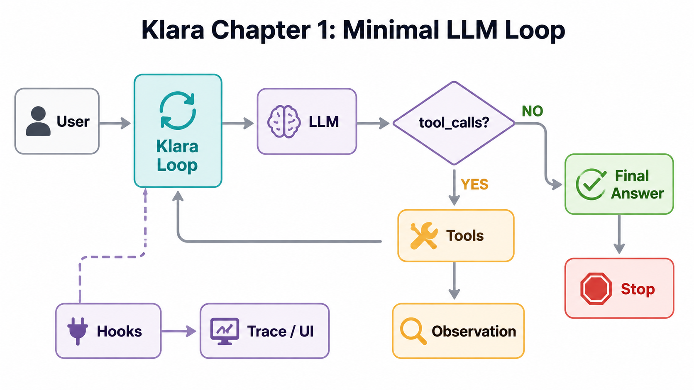

# Chapter 1: Minimal LLM Loop

Language: [中文](./ch01-minimal-agent-loop.md) | English

Previous: none  
Next: Chapter 2: Tool Calling
Roadmap: [Klara Roadmap](../skills/roadmap.md)

---

## The Chapter In One Sentence

Klara moves from a one-shot pipeline to a minimal loop: if the model asks for tools, runtime executes them and continues; if the model asks for no tools, the loop stops and returns the answer.



| What Klara sees | What Klara does |
| --- | --- |
| `tool_calls` exists | Execute tools, append observations, continue |
| no `tool_calls` | Return the final answer and stop |
| `max_turns` reached | Stop by policy and expose the stop reason |

## Quick Experience

After `.env` is ready, start backend and frontend together:

```powershell
.\scripts\dev.ps1
```

Open:

```text
http://127.0.0.1:5123
```

Ask first:

```text
Introduce yourself in one sentence.
```

You should see: the model answers directly and the run ends.

Then ask:

```text
Please use the debug_echo tool to echo klara-loop, then tell me what you saw.
```

You should see: the model requests `debug_echo`, runtime executes the tool, the observation returns to context, and the loop either continues or returns the final answer.

## Why Start With A Loop

The old pipeline shape was a fixed path:

```text
question -> retrieve -> prompt -> answer
```

Klara needs to learn how to run one turn, inspect the result, then decide whether to continue or stop. That skeleton is where later tool registry, RAG, memory, hooks, context compression, and RL will attach.

Klara learns: an agent run is not a black-box model call. It is an observable, testable, continuable, stoppable runtime loop.

---

## 1. The Harness Assembles One Run

The core loop does not read environment variables, choose persona, or know frontend and storage paths.
The app-layer harness assembles those dependencies and injects them into the loop.

```text
user input
-> KlaraHarness
-> persona + model + tools + hooks + policy
-> KlaraLoop
```

Klara learns: core executes runtime logic; the app layer assembles the runtime world.

Code:

```text
src/klara/app/harness.py
```

<details>
<summary>Expand: how the harness injects trace hooks and tools</summary>

Real code:

```python
# Hooks are built per run so trace sinks do not leak across executions.
hooks = HookManager()
if self.config.trace_path is not None:
    hooks.register(JsonlTraceHook(self.config.trace_path))

# The harness converts visible capabilities into the core executor boundary.
loop = KlaraLoop(
    llm=self.llm,
    tool_executor=ToolExecutor(list(self.registry.visible_tools())),
    hooks=hooks,
    policy=LoopPolicy(max_turns=self.config.max_turns),
    model=self.config.model,
    system_prompt=self._system_prompt(),
)
return loop.run(user_input, run_id=run_id)
```

This code:

- creates a run-local `HookManager`
- registers `JsonlTraceHook` when a trace path exists
- injects LLM, tools, hooks, policy, model, and system prompt into `KlaraLoop`

The key boundary: `KlaraLoop` does not read `.env`, create trace files, or choose tools. It receives prepared dependencies.

</details>

## 2. The Loop Receives Dependencies

`KlaraLoop` is the runtime core, not the product entry point. It stores dependencies, then executes the loop in `run()`.

```text
llm + tool_executor + hooks + policy + model + system_prompt
-> KlaraLoop
```

Klara learns: keep the loop small and inject dependencies explicitly.

Code:

```text
src/klara/core/loop.py
```

<details>
<summary>Expand: reading KlaraLoop.__init__</summary>

Real code:

```python
def __init__(
    self,
    *,
    llm: LlmClient,
    tool_executor: ToolExecutor,
    hooks: HookManager | None = None,
    policy: LoopPolicy | None = None,
    model: str = "fake-model",
    system_prompt: str = "",
) -> None:
```

Parameters:

- `llm`: the model client.
- `tool_executor`: the boundary that executes requested tools.
- `hooks`: the runtime lifecycle event outlet.
- `policy`: loop boundaries such as max turns.
- `model`: the selected model for this run.
- `system_prompt`: Klara's identity and behavior constraints.

Real code:

```python
# Dependencies are injected so core stays independent of providers/services.
self.llm = llm
self.tool_executor = tool_executor
self.hooks = hooks or HookManager()
self.policy = policy or LoopPolicy()
self.model = model
self.system_prompt = system_prompt
```

The point is the boundary:

- providers are not created in core
- trace sinks are not created in core
- frontend bridges are not created in core
- visible tools are not discovered in core

</details>

## 3. A Run Starts From One User Message

The first step is not the model call. The run first needs a stable identity and one user message.

```text
user_input
-> run_id
-> [KlaraMessage(role="user")]
-> run.started event
```

Klara learns: trace, frontend events, and tests need the same `run_id` join key.

Code:

```text
src/klara/core/loop.py
src/klara/core/messages.py
src/klara/core/events.py
```

<details>
<summary>Expand: the beginning of run()</summary>

Real code:

```python
# Active run id is the trace join key across all lifecycle events.
active_run_id = run_id or str(uuid4())
# Messages begin with exactly one user message; later turns append to it.
messages: list[KlaraMessage] = [KlaraMessage(role="user", content=user_input)]
self._emit(active_run_id, "run.started", {"model": self.model})
```

Line by line:

- `active_run_id` identifies the run.
- tests and APIs can pass a stable `run_id`.
- otherwise, the loop generates a UUID.
- `messages` starts with one user message.
- `run.started` is emitted to hooks, not directly written as a log.

Trace is therefore not hardcoded logging inside the loop. The loop emits events; `JsonlTraceHook` writes them.

</details>

## 4. Each Turn Calls The LLM First

Each turn sends the current transcript, system prompt, tool specs, and model id to the LLM client.

```text
system_prompt + messages + tool specs + model
-> llm.complete(...)
-> ModelResponse(content, tool_calls)
```

Klara learns: the LLM call is one step inside the loop, not the whole agent.

Code:

```text
src/klara/core/loop.py
src/klara/core/messages.py
src/klara/infra/llm/openai_compatible.py
```

<details>
<summary>Expand: LLM call code</summary>

Real code:

```python
self._emit(active_run_id, "turn.started", {"turn_index": turn_index})
self._emit(active_run_id, "llm.started", {"turn_index": turn_index})
# Ask the injected model using only the prompt, transcript, and specs.
response = self.llm.complete(
    system_prompt=self.system_prompt,
    messages=tuple(messages),
    tools=self.tool_executor.specs,
    model=self.model,
)
```

The call receives:

- `system_prompt`: Klara's behavior contract.
- `messages`: the visible transcript so far.
- `tools`: the tool schemas visible to the model.
- `model`: the selected model.

The result is a `ModelResponse`, which may contain final text or tool calls.

</details>

## 5. `tool_calls` Decides Continue Or Stop

This is Chapter 1's core decision:

```text
response.tool_calls?
-> yes: execute tools, append observations, continue
-> no: final answer, stop
```

Klara learns: the model can request tools, but runtime executes them.

Code:

```text
src/klara/core/loop.py
src/klara/core/tool_executor.py
src/klara/capabilities/tools/debug_echo/tool.py
```

<details>
<summary>Expand: how a tool call becomes an observation</summary>

Real code:

```python
if not response.tool_calls:
    # No tool calls means the assistant content is the final answer.
    self._emit(active_run_id, "turn.completed", {"turn_index": turn_index})
    return self._complete(
        active_run_id,
        messages,
        response.content,
        StopReason.FINAL,
    )
```

If there are no `tool_calls`, the loop ends.

If there are `tool_calls`, runtime executes every tool:

```python
# Execute every requested tool before preparing the next model turn.
for call in response.tool_calls:
    self._emit(
        active_run_id,
        "tool.started",
        {"turn_index": turn_index, "tool_call": call.to_public_dict()},
    )
    # Tool results become model-visible observations.
    result = self.tool_executor.execute(call)
    self._emit(
        active_run_id,
        "tool.completed",
        {
            "turn_index": turn_index,
            "tool_result": result.to_public_dict(),
        },
    )
    messages.append(
        KlaraMessage(
            role="tool",
            name=result.name,
            tool_call_id=result.tool_call_id,
            content=result.content if result.ok else result.error or "",
        )
    )
```

Runtime state changes here: the tool result becomes a `role="tool"` message. It is not hidden state; the next LLM turn can see it as an observation.

</details>

## 6. prepare_next_turn Starts Minimal

Chapter 1 keeps `prepare_next_turn` as identity: no compression, rewriting, or memory injection yet.  
The boundary exists now because later context compression, memory, RAG, and tool effects need it.

```text
messages
-> prepare_next_turn(messages)
-> messages for next LLM turn
```

Klara learns: next-turn context needs a deliberate preparation phase.

Code:

```text
src/klara/core/loop.py
```

<details>
<summary>Expand: the minimal prepare_next_turn step</summary>

Real code:

```python
# The minimal loop keeps preparation as identity until context policy exists.
self._emit(
    active_run_id,
    "prepare_next_turn.started",
    {"turn_index": turn_index},
)
messages = self.prepare_next_turn(messages)
self._emit(
    active_run_id,
    "prepare_next_turn.completed",
    {"turn_index": turn_index, "message_count": len(messages)},
)
self._emit(active_run_id, "turn.completed", {"turn_index": turn_index})
```

This chapter does not compress context yet, but the event boundary already exists. Later chapters can add real context preparation without rewriting the loop shape.

</details>

## 7. The Loop Must Explain Why It Stopped

Klara should not merely be "done." She should know why the loop ended.

```text
no tool calls -> StopReason.FINAL
max turns -> StopReason.MAX_TURNS
unexpected error -> run.failed
```

Klara learns: stopping is part of runtime policy.

Code:

```text
src/klara/core/loop.py
src/klara/core/policies.py
```

<details>
<summary>Expand: final and max-turn stopping</summary>

If the model keeps requesting tools until the turn budget is exhausted:

```python
# At max turns, expose the last visible content and explicit stop reason.
final_answer = messages[-1].content if messages else ""
return self._complete(
    active_run_id,
    messages,
    final_answer,
    StopReason.MAX_TURNS,
)
```

Completion is still emitted as an event:

```python
self._emit(run_id, "run.completed", {"stop_reason": stop_reason.value})
```

The stop reason enters trace and the final `KlaraRunResult`.

</details>

## 8. Hooks Attach Trace And UI

Chapter 1 uses hooks as observers: hooks receive events but do not change loop behavior.

```text
KlaraLoop._emit(...)
-> HookManager.emit(event)
-> JsonlTraceHook.on_event(event)
-> frontend bridge on_event(event)
```

Klara learns: trace is not hardcoded logging. It is the first hook implementation.

Code:

```text
src/klara/core/events.py
src/klara/core/hooks.py
apps/api/services/run_service.py
tests/klara/core/test_hooks.py
```

<details>
<summary>Expand: HookManager and JsonlTraceHook</summary>

Real code:

```python
class KlaraHook(Protocol):
    """Protocol for observers or guards attached to loop lifecycle events."""

    def on_event(self, event: KlaraEvent) -> None:
        """Handle one loop event."""

        ...
```

Chapter 1 only uses observer hooks. Later chapters can introduce `PreToolUse`, `PostToolUse`, and `Stop` lifecycle hooks.

Real code:

```python
def emit(self, event: KlaraEvent) -> None:
    """Send an event to every hook and record hook-level failures."""

    # Visit hooks sequentially so trace and policy hooks see stable order.
    for hook in self._hooks:
        try:
            hook.on_event(event)
        except Exception as exc:  # pragma: no cover - exact hook errors vary
            # Hook failures are runtime observations, not loop failures.
            self.failures.append((event.type, f"{type(exc).__name__}: {exc}"))
```

Hook failure does not crash the loop. It becomes hook failure data.

Real code:

```python
class JsonlTraceHook:
    """Persist public lifecycle events as newline-delimited JSON."""

    def on_event(self, event: KlaraEvent) -> None:
        """Append one public event to the JSONL trace file."""

        # Ensure local trace directories exist before appending the event.
        self.path.parent.mkdir(parents=True, exist_ok=True)
        with self.path.open("a", encoding="utf-8") as handle:
            handle.write(json.dumps(event.to_public_dict(), ensure_ascii=False) + "\n")
```

Core principle:

```text
loop emits events
hook consumes events
trace is one hook implementation
```

The frontend event stream follows the same idea. The API layer attaches `_RunEventBridge` and `JsonlTraceHook` to one `HookManager`:

```python
usage_totals = _UsageTotals()
bridge = _RunEventBridge(self, run_id, usage_totals)
hooks = HookManager([bridge, JsonlTraceHook(Path(self.trace_path))])
```

</details>

## 9. Real LLM Config Lives In Infra

Chapter 1 can use real models, but providers stay in infra. Core only knows the `LlmClient` protocol.

```text
.env
-> config/models.toml
-> RoutedLlmClient
-> OpenAICompatibleLlmClient
-> KlaraLoop
```

Klara learns: DeepSeek and Qwen are replaceable providers, not part of the loop.

Code:

```text
config/models.toml
config/README.md
src/klara/infra/llm/openai_compatible.py
src/klara/infra/llm/routed_client.py
```

<details>
<summary>Expand: why real LLM support does not change the loop</summary>

The core loop only needs:

```text
complete(system_prompt, messages, tools, model) -> ModelResponse
```

Provider details stay outside core:

- API key
- base URL
- provider name
- HTTP response shape
- retry strategy
- model routing

Required keys:

```text
DEEPSEEK_API_KEY
DASHSCOPE_API_KEY
```

Current chat models:

```text
deepseek/deepseek-v4-flash
deepseek/deepseek-v4-pro
qwen/qwen3.7-plus
qwen/qwen3.7-max
```

The default `agent` profile uses `qwen/qwen3.7-plus` because it can handle normal chat, tool calling, and image understanding. Qwen image models live in `config/images.toml` and enter the loop through the later `image_generate` capability rather than the chat model picker.

</details>

## Run And Verify

1. Install Python dependencies:

```powershell
python -m pip install -e ".[dev]"
```

2. Create `.env` at the repo root:

```powershell
Copy-Item .env.example .env
```

3. Fill in your keys:

```text
DEEPSEEK_API_KEY=...
DASHSCOPE_API_KEY=...
```

4. Start backend and frontend together:

```powershell
.\scripts\dev.ps1
```

Default URLs:

```text
API: http://127.0.0.1:8011
Web: http://127.0.0.1:5123
```

5. Run core tests:

```powershell
python -m pytest tests\klara\core\test_hooks.py tests\klara\app\test_harness.py
```

These tests confirm:

- hook failures do not crash the loop
- JSONL trace is written through hooks
- the harness assembles persona, tools, user context, and trace hook

## Small Experiments

- Lower `KlaraHarnessConfig.max_turns`, then observe `StopReason.MAX_TURNS`.
- Ask the model to use `debug_echo`, then inspect `tool.started` and `tool.completed` order in the event area.
- Open the local trace JSONL and confirm one `run_id` joins `run.started`, `llm.completed`, `tool.completed`, and `run.completed`.

## Next Chapter

Chapter 2 upgrades this minimal tool path into complete tool calling: tool packages, schemas, metadata, registry, executor, serial/parallel execution, and error observations.

Klara will learn:

- how to expose tool schemas to the LLM
- how runtime executes tool calls
- how tool results return as observations for the next turn
- how to select chapter-visible tools from a larger registry
- how to trace tool selection, tool start, tool result, and tool error

Chapter 1's rule remains: the loop owns runtime shape, capabilities attach through boundaries, and trace observes through hooks.
