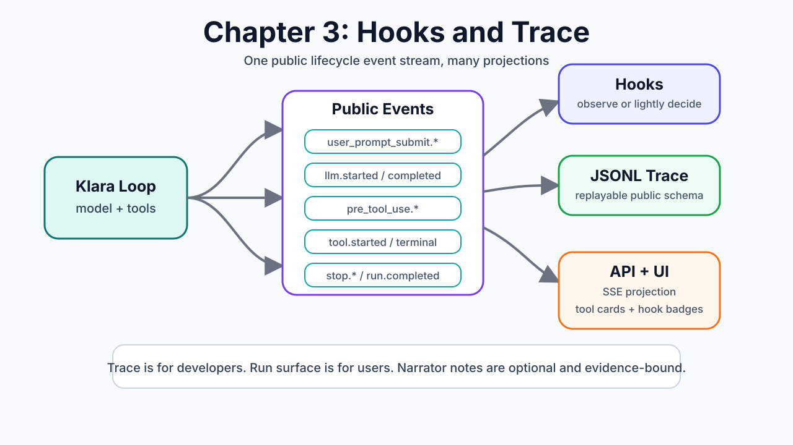

# Chapter 3: Hooks and Trace

语言：中文 | [English](./ch03-hooks-and-trace.en.md)

上一章：[Chapter 2: Tool Calling](./ch02-tool-calling.md)

下一章：Chapter 4: Harness And Config

总路线：[Klara Roadmap](../skills/roadmap.md)

---

## 一句话看懂本章

Chapter 3 不给 loop 加业务规则，而是把 Klara 的运行过程拆成三层：GPT-like Thinking Trigger、Activity Drawer、Developer Debug。



## 三层界面

### 1. Top Thinking Trigger

用户主路径只看到一个轻量入口：

```text
运行中：Klara · Thinking... 1.2s
完成后：Klara · Thought for 24.2s >
```

完成态的 `Thought for X` 必须绑定真实可展示内容：

- 有 provider/model 返回的安全 reasoning summary；
- 或有 narrator 基于 runtime facts 生成的 Klara activity items。

如果两条都没有，就不显示空的 `Thought for X`。运行耗时仍然在 Developer Debug 里可见。

交互上，左侧是 mini Klara icon + label，右侧 chevron 是独立按钮。点击文字不展开，只有 chevron 打开 Activity Drawer。

### 2. Activity Drawer

Activity Drawer 分两段：

```text
Model thinking  -> provider_reasoning summary；没有就隐藏
Klara activity  -> narrator_model 基于 activity facts 生成的公开工作流
```

这里的“真实 thinking”不是 raw chain-of-thought：

- `Model thinking` 来自 provider/model 自己返回的公开 reasoning summary，有就展示，没有不伪造。
- `Klara activity` 来自 `activity_fact_recorded` + narrator model。facts 只记录结构化事实，narrator 才写可读的公开 activity。
- narrator 不可用、JSON 错误或校验失败时，不生成模板句子，只在 Developer Debug 里留下诊断事件。

### 3. Developer Debug

Developer Debug 默认折叠，只给开发和教学看：

- LLM rounds：turn、model、duration、input/output/total tokens、token source。
- Tools：tool name、status、duration、arguments preview、observation preview。
- Activity facts：结构化 facts、request preview、evidence ids。
- Narrator diagnostics：started、completed、rejected、failed。
- Trace：event id、created_at、event_type、raw payload。

## 两条真实来源

### A. Model Thinking / Provider Reasoning

Provider 如果返回 `reasoning_content`、`reasoning`、`thinking` 等公开 reasoning 字段，Klara 会把它转成：

```text
provider_reasoning_delta
provider_reasoning_completed
```

它只用于 UI 展示，不写进 assistant message，也不会进入下一轮主模型上下文。

### B. Klara Activity / Agent Workstream

Runtime 只产生 fact，不直接写用户可见文案：

```json
{
  "id": "fact_evt_...",
  "kind": "request_orientation",
  "status": "completed",
  "source_event_type": "thinking_summary_started",
  "evidence_event_ids": ["evt_..."],
  "request": {
    "preview": "用户请求的脱敏短摘要",
    "language": "zh"
  }
}
```

工具、搜索、网页读取、图片生成、错误也会形成各自的 fact。fact 不能包含 `title` / `body`，不能暴露完整 URL、raw arguments、raw observation、secret 或 hidden reasoning。

Narrator 只根据 facts 输出公开 activity item：

```json
{
  "title": "理解请求目标",
  "body": "Klara 先识别了你想要整理的主题和回答方向。",
  "kind": "orientation",
  "source": "narrator_model",
  "evidence_fact_ids": ["fact_evt_..."],
  "evidence_event_ids": ["evt_..."],
  "confidence": 0.8
}
```

如果 item 声称搜索、读取、验证、生成图片、编辑或测试，必须有对应 fact 支撑。

## 为什么之前是假的

之前的问题是：

- 只有 timer，也会显示 `Thought for X`。
- `provider_reasoning_delta` 有类型但没有真实 emitter。
- narrator 不可用时前端仍能打开空 drawer。
- runtime event 被直接包装成 “Reading request / Writing answer” 这类模板 activity。

现在的规则是：没有 provider reasoning，也没有安全 narrator items，就不显示 `Thought for X`。

## 快速体验

启动：

```powershell
.\scripts\dev.ps1
```

打开：

```text
http://127.0.0.1:5123
```

可以试：

```text
现在上海时间几点？
帮我搜一下最新世界杯赛程
生成一张克拉拉形象图
```

验收时看三件事：

1. 顶部没有空的 `Thought for X`。
2. Activity Drawer 只显示 `Model thinking` 或 `Klara activity`，不显示 raw trace。
3. Developer Debug 才显示 tools、facts、narrator diagnostics、raw payload 和 metrics。

## 本章不做什么

Chapter 3 不展示 raw chain-of-thought，不做 intent router，不做 domain guard，不做搜索关键词规则，不做 source ranker，不做 grounding verifier，不做 memory/context compression。

这些放在后续章节。本章只把 thinking、activity、debug 的边界立住。
