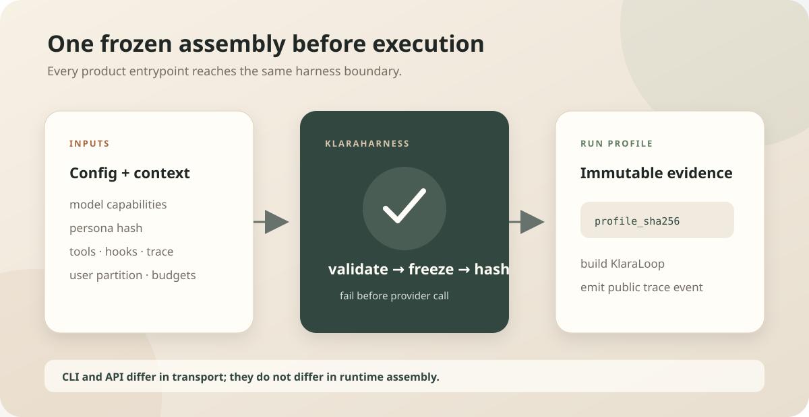

# Chapter 4: Harness and Config

Language: [Chinese](./ch04-harness-and-config.md) | English

Previous: [Chapter 3: Hooks and Trace](./ch03-hooks-and-trace.en.md)

Next: [Chapter 5: Todo Planning](../skills/roadmap.md#chapter-5---todo-planning)

Roadmap: [Klara Roadmap](../skills/roadmap.md)

---

## Understand This Chapter in One Sentence

Before the loop starts, one Klara harness validates model capabilities and freezes persona, tools, hooks, trace, user context, and budgets into a reproducible run profile.



| Startup signal | What the harness does |
| --- | --- |
| Model satisfies profile requirements | Generate `profile_sha256`, then construct the loop |
| Model lacks tools, thinking, or another requirement | Fail before the first LLM request |
| Profile requests a missing tool | Fail before startup |
| API or CLI creates a run | Both pass through the same `KlaraHarness` |

## Quick Experience

Print a safe run profile without calling a real model:

```powershell
$env:PYTHONPATH = "src;."
python -m klara.app.cli --profile-only
```

You will see the model, capability profile, visible tools, hooks, loop budgets, persona hash, and `profile_sha256`. You will not see API keys, provider URLs, or `.env` contents.

Then start the web app:

```powershell
.\scripts\dev.ps1
```

Open the model picker. Tools, JSON, Vision, and Thinking badges come from `config/models.toml`; the frontend does not hard-code them.

## The Real Problem: Why Having a Harness Class Was Not Enough

Direct unit tests previously used `KlaraHarness`, while the real API manually created another `KlaraLoop` inside `RunService`. Those paths could silently receive different tools, hooks, prompts, and budgets. A config file also could not prove what one run actually used.

Chapter 4 creates a single product assembly boundary and records the resulting assembly as evidence.

## Mechanism One: A Capability Profile Describes What a Run Needs

`runtime.capability_profiles.agent` in `config/runtime.toml` declares required model capabilities, visible tools, hooks, and the trace sink. The loader parses it into an immutable `CapabilityProfile` and rejects unknown capabilities, duplicates, invalid sinks, and a missing default profile.

<details>
<summary>Inspect the real config and types</summary>

```text
config/runtime.toml
src/klara/infra/config/runtime.py
src/klara/infra/config/loader.py
```

`LoopPolicy` remains a pure core budget object. Loading and environment overrides remain in infra, so core never reads TOML or `.env`.

</details>

## Mechanism Two: The Harness Negotiates Model and Tool Capabilities Before Execution

`KlaraHarness` parses `provider/model`, reads Tools, JSON, Vision, and Thinking flags from `ProviderModel`, and compares them with the capability profile. A missing tool or unsupported model capability fails while the harness is being built, with zero LLM calls.

<details>
<summary>Inspect the preflight rejection tests</summary>

```text
src/klara/app/harness.py
tests/klara/app/test_harness.py
tests/klara/infra/config/test_loader.py
```

`update_activity` is an internal public-activity tool injected by core. The harness validates it separately from registry business tools while preserving it in the model-visible profile.

</details>

## Mechanism Three: The Run Profile Is Reproducible Without Leaking Connections

`KlaraRunProfile` is a frozen dataclass. It includes public configuration that changes behavior and computes SHA-256 over stable JSON. Identical inputs produce identical hashes. Persona appears only as a content hash; API-key names and values, base URLs, and provider-private fields never enter the profile.

```text
config + persona + tools + hooks + context + budgets
-> stable public JSON
-> profile_sha256
-> run_profile_frozen event
```

Developer Debug can show this public event and answer how a run was assembled, without becoming a credential reader.

## Mechanism Four: API and CLI Share One Assembly Entry

`RunService` still owns sessions, SSE, cancellation, and persistence, but it no longer constructs `KlaraLoop` directly. It supplies the API-selected model, thinking setting, browser timezone, and history to the harness. The CLI owns only arguments and output and also calls the harness.

<details>
<summary>Inspect the product entrypoints</summary>

```text
apps/api/services/run_service.py
src/klara/app/cli.py
tests/klara/architecture/test_product_entrypoints.py
```

Architecture tests explicitly prohibit `KlaraLoop(` in both product entrypoints so later changes cannot bypass the harness accidentally.

</details>

## Run and Verify

```powershell
$env:PYTHONPATH = "src;."
python -m klara.eval.chapter04_cli `
  --repository-root . `
  --json-out docs/reports/product/ch04-harness-config.json `
  --markdown-out docs/reports/product/ch04-harness-config.md `
  --markdown-en-out docs/reports/product/ch04-harness-config.en.md
python -m pytest -q
Push-Location apps/web
npm test
npm run build
Pop-Location
```

The machine gate must pass `11/11` checks covering shared entrypoints, hash validation, model/tool capabilities, trace, secret scanning, and the stage manifest.

## Small Experiments

1. Change the agent profile `required_model_capabilities` to `vision`, select a non-vision model, and observe rejection before startup.
2. Run `--profile-only` twice and confirm that `profile_sha256` is identical.
3. Change one persona character and confirm that both the persona hash and profile hash change.

## Next Chapter Preview

Chapter 4 guarantees that every run starts from the same verifiable assembly. Chapter 5 adds Todo Planning so a long task's goal, steps, and changes become formal state visible in trace and UI.
