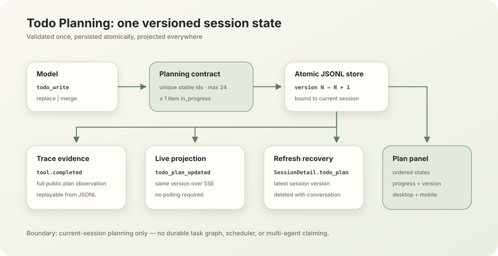

# Chapter 5：Todo Planning

语言：中文 | [English](./ch05-todo-planning.en.md)

上一章：[Chapter 4：Harness 与 Config](./ch04-harness-and-config.md)

下一章：[Chapter 6：System Prompt 与 Context Assembly](../skills/roadmap.md#chapter-6---system-prompt-and-context-assembly)

总路线：[Klara Roadmap](../skills/roadmap.md)

---

## 一句话看懂本章

Klara 把多步骤任务的计划变成一个有 schema、有版本、受约束的当前会话状态；模型通过 `todo_write` 更新一次，JSONL trace、SSE、页面刷新和计划面板就看到同一个版本。



| 用户任务 | 计划行为 |
| --- | --- |
| 简单问答或单步请求 | 直接回答，不创建多余计划 |
| 需要多步工具工作 | 在实质工作前创建计划 |
| 工作推进或范围变化 | `merge` 更新原位置，或 `replace` 重建顺序 |
| 声称完成 | 先用验证证据把相应步骤标记为 `completed` |

## 快速体验

启动本地产品：

```powershell
.\scripts\dev.ps1
```

提交一个明确的多步骤任务，例如：

```text
检查仓库、修复失败测试、运行相关测试，然后写一份简短报告。
```

当模型选择规划时，聊天区会显示当前计划、完成进度与版本。刷新页面后计划仍在；删除对话后，计划记录也被清除。简单问题不应为了展示功能而生成计划。

## 为什么不能把计划只写在自然语言里

自然语言列表适合阅读，却无法可靠回答这些产品问题：哪个步骤正在进行、一次更新是否覆盖了另一更新、刷新后状态是否相同、模型是否在没有验证时声称完成、前端和 trace 是否展示同一次变更。

Chapter 5 因此把计划分成三层：

```text
TodoItem  -> 单个稳定步骤及状态
TodoPlan  -> 当前会话的有序、版本化快照
todo_write -> 模型调用的 replace / merge 更新入口
```

## 机制一：状态机在写入前拒绝奇怪计划

`TodoItem` 只接受稳定的小写 id、非空标题，以及 `pending`、`in_progress`、`completed` 三种状态。`TodoPlan` 最多容纳 24 个唯一步骤，并强制最多一个 `in_progress`。

<details>
<summary>查看真实契约</summary>

```text
src/klara/planning/todo.py
src/klara/planning/tool.py
tests/klara/planning/test_todo.py
tests/klara/planning/test_tool.py
```

无效更新会成为模型可见的失败 observation，而不是写入一半状态或让整个 Agent loop 崩溃。

</details>

## 机制二：replace 与 merge 的语义确定且可复现

`replace` 使用输入顺序创建完整的新快照。`merge` 是有序 upsert：已有 id 在原位置更新，新 id 按输入顺序追加。每次成功更新都把版本严格增加一。

```text
v4: [inspect(done), build(active)]
merge: [build(done), verify(active)]
v5: [inspect(done), build(done), verify(active)]
```

更新计算与 JSONL append 位于同一个重入锁内，因此并发更新会获得不同的单调版本，不会同时从同一个旧版本派生。

## 机制三：计划属于会话，而不是某一次模型调用

API 为每个 run 构造绑定当前 `session_id` 的 `TodoWriteTool`。存储只返回可见会话的最新计划；页面刷新通过 `SessionDetail.todo_plan` 恢复。删除对话会同时清除消息、run、event、trace 和 todo plan。

<details>
<summary>查看持久化边界</summary>

```text
apps/api/services/app_store.py
apps/api/services/run_service.py
apps/api/routes/sessions.py
tests/apps/api/test_todo_planning.py
```

CLI 也通过同一个 harness 暴露 `todo_write`，但教学 CLI 只保留当前进程内计划；产品级会话恢复由 API JSONL store 提供。

</details>

## 机制四：一次更新产生两类可验证投影

核心 trace 的 `tool.completed` 保存 `todo_write` 的完整公共 plan observation，因此可以回放工具事实。产品层再从这份 observation 校验 `TodoPlan`，发出 `todo_plan_updated` SSE 事件。前端不猜状态，也不从自然语言里解析复选框。

```text
todo_write result
├─ JSONL trace: tool.completed.payload.tool_result.content
└─ API/SSE: todo_plan_updated.payload
   ├─ live React state
   └─ accessible Plan panel
```

## 机制五：计划 UI 展示进度，但不抢占对话

计划面板位于消息滚动区顶端，展示顺序、状态、完成比例和版本。它不暴露 `session_id` 或内部 item id。窄屏隐藏重复的状态文字但保留图形标记和标题；暗色主题使用同一设计 token。

<details>
<summary>查看前端数据链</summary>

```text
apps/web/src/types/domain.ts
apps/web/src/api/client.ts
apps/web/src/App.tsx
apps/web/src/components/ChatWorkspace.tsx
apps/web/src/components/PlanPanel.test.tsx
apps/web/src/App.e2e.test.tsx
```

恢复测试与实时 SSE 测试分别覆盖刷新和运行中更新，浏览器证据再覆盖桌面与窄屏布局。

</details>

## 运行与验证

```powershell
$env:PYTHONPATH = "src;."
python -m klara.eval.chapter05_cli `
  --repository-root . `
  --json-out docs/reports/product/ch05-todo-planning.json `
  --markdown-out docs/reports/product/ch05-todo-planning.md `
  --markdown-en-out docs/reports/product/ch05-todo-planning.en.md
python -m pytest -q
Push-Location apps/web
npm test
npm run build
Pop-Location
```

本章机器门禁使用真实 `RunService -> KlaraHarness -> todo_write -> store -> projection` 产品路径，不把手写成功结果当作能力证明。行为评测的控制探针仍只验证评测基础设施，不能宣称产品达到 GPT 水平。

## 小实验

1. 创建两个 `in_progress` 步骤，确认工具返回失败 observation，旧计划不变。
2. 对已有步骤执行 `merge`，确认它在原位置更新，新步骤只追加到末尾。
3. 刷新页面确认版本不变，再删除对话并检查 `todo_plans.jsonl` 中对应记录被清除。
4. 提交一句简单定义题，确认 persona 指导模型直接回答而不滥用 `todo_write`。

## 本章边界

本章只解决当前会话不漂移。跨重启依赖图、认领/租约、重试、调度和多 Agent 协作属于 Chapter 14–16；把 Todo 包装成那些能力会制造错误的完成声明。

## 下一章预告

Chapter 6 会把 persona、历史、工具说明、运行时状态和预算装配成明确的 context contract；Chapter 7 再处理真正超出窗口后的压缩与恢复。
