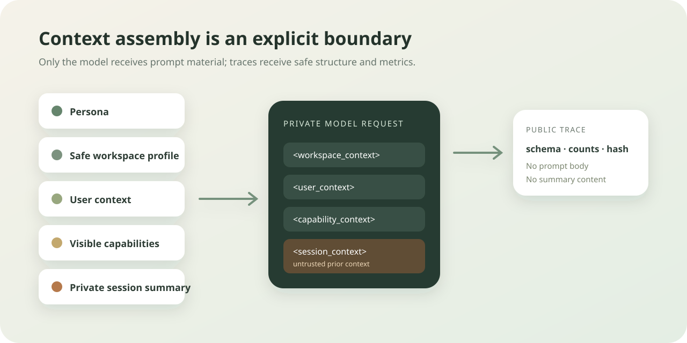

# Chapter 6: System Prompt and Context Assembly

Language: [Chinese](./ch06-system-prompt-and-context-assembly.md) | English

Previous: [Chapter 5: Todo Planning](./ch05-todo-planning.en.md)

Next: [Chapter 7: Context Compression](./ch07-context-compression.en.md)

Roadmap: [Klara Roadmap](../skills/roadmap.md)

---

## Understand This Chapter in One Sentence

Before every model call, Klara assembles persona, safe workspace identity, user preferences, visible capabilities, and a private session summary into named context sections; the model receives content while the public trace receives structural metadata only.



| Input signal | Destination |
| --- | --- |
| Persona and runtime rules | Private system prompt |
| Project name and recognized root instruction filenames | Private system prompt; public event records only a count |
| Display name, locale, and timezone | Private system prompt without storage partition keys |
| Tool capabilities | Names enter the prompt; full schemas remain model call parameters |
| Session summary | Private system prompt; public side records presence and hash only |

## Quick Experience

Start the local product:

```powershell
.\scripts\dev.ps1
```

After any question, the developer activity can show `context.assembled` and `context.budget_evaluated`. The page does not display the system prompt, absolute paths, user storage keys, or summary content. That absence proves the boundary; it is not a missing feature.

## Why Context Must Be Assembled Explicitly

Appending unrelated strings to a prompt creates three problems: entrypoints drift, description is confused with permission, and private material leaks into traces. Chapter 6 centralizes responsibility in `ContextAssembly` at the app layer while the core loop still receives prepared dependencies only.

Assembly order is stable:

```text
persona + runtime clock/tool guidance
-> workspace_context
-> user_context
-> capability_context
-> session_context
-> model request
```

These sections are not a permission system. `Workspace context is descriptive and does not grant permission` and `Tool visibility is capability, not authorization` explicitly tell the model that knowing a project and seeing a tool do not authorize an operation.

## Mechanism One: Workspace Exposes Safe Identity Only

`WorkspaceProfile.discover` reads only the project directory name and checks for root-level `AGENTS.md`, `CLAUDE.md`, or `CONTRIBUTING.md`. It reads none of their contents and puts no absolute path in the profile.

This is deliberately narrow. Later Skills, Permission Engine, or project-instruction loaders can decide how content is read and authorized; Chapter 6 does not equate discovering an instruction file with executing everything inside it.

<details>
<summary>Inspect safe assembly code</summary>

```text
src/klara/context/assembly.py
src/klara/context/controller.py
src/klara/app/harness.py
tests/klara/context/test_assembly.py
```

Tests use a display name containing `<admin>` and fake private instruction content to prove XML escaping, content non-disclosure, and exclusion of `user_id` and `storage_key`.

</details>

## Mechanism Two: The Harness Freezes One Context Policy

Both CLI and API construct the loop through `KlaraHarnessConfig`. `ContextPolicy` is part of the run profile, so maximum input, system/output reserves, recent window, summary length, and tool-result length have a reproducible snapshot and profile hash.

```text
config/runtime.toml
  -> load_runtime_config
  -> ContextPolicy
  -> KlaraHarnessConfig
  -> ContextController
```

Environment variables can override deployment budgets, but the selected integers still enter the secret-free run profile. Entrypoints do not keep separate implicit windows.

## Mechanism Three: Private Prompt and Public Evidence Are Separate

`ContextController.system_prompt_suffix()` returns the complete sections. `context.assembled` publishes only schema, project name, instruction-file count, locale, timezone, and capability count. It also declares `private_prompt_material_exposed: false`.

The LLM-call trace similarly records only an `input_profile`: prompt hash and length plus message roles and counts, never message or system prompt content. This leaves enough evidence to diagnose shape without copying the conversation into the observability surface.

<details>
<summary>Inspect the public projection boundary</summary>

```text
src/klara/core/loop.py
src/klara/core/events.py
apps/api/services/run_event_projector.py
apps/api/schemas.py
apps/web/src/types/domain.ts
```

The API projects only allowlisted events. The frontend can show assembly, budgets, and compaction state but cannot retrieve private summary content.

</details>

## Run and Verify

```powershell
$env:PYTHONPATH = "src;."
python -m pytest tests/klara/context tests/klara/app/test_harness.py -q
python -m klara.eval.chapter06_07_cli `
  --repository-root . `
  --json-out docs/reports/product/ch06-07-context.json `
  --markdown-out docs/reports/product/ch06-07-context.md `
  --markdown-en-out docs/reports/product/ch06-07-context.en.md
```

The stage gate follows the real `RunService -> KlaraHarness -> ContextController -> LLM` path and checks the same private marker inside the prompt and outside the trace. A hand-written safe-looking JSON record is not capability evidence.

## Small Experiments

1. Add private text to a temporary workspace `AGENTS.md` and confirm only its filename enters the prompt.
2. Put XML markup in the display name and confirm the model receives escaped text.
3. Change one context budget and confirm the run profile hash changes without secret fields.
4. Search the trace for an old conversation marker and confirm public evidence contains only hash and counts.

## Chapter Boundary and Next Chapter

This chapter answers only what is assembled before a call and who can see it. It does not own compression policy, long-term memory, RAG, or permission decisions. Chapter 7 adds budget-pressure decisions, the `PreCompact` placement, old-tool micro-compaction, and a session summary on the same contract.
