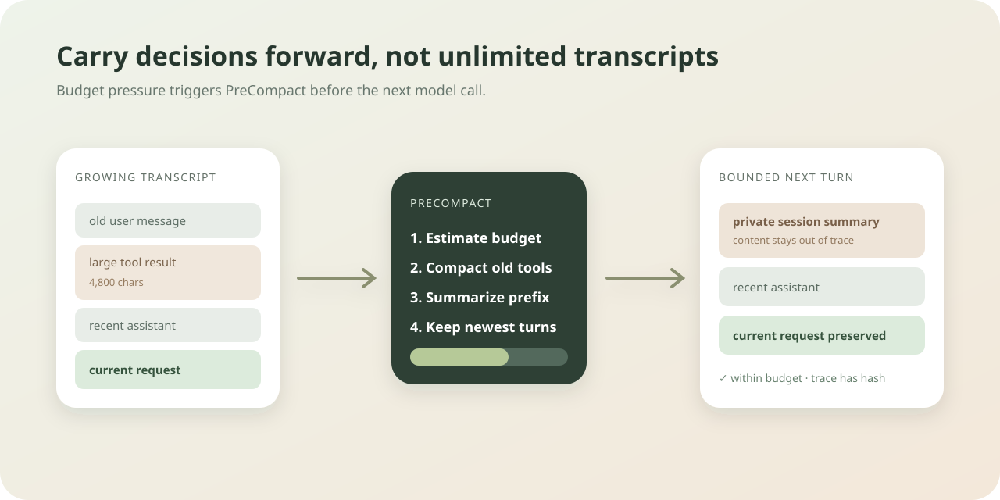

# Chapter 7: Context Compression

Language: [Chinese](./ch07-context-compression.md) | English

Previous: [Chapter 6: System Prompt and Context Assembly](./ch06-system-prompt-and-context-assembly.en.md)

Next: [Chapter 8: Error Recovery and Fallback](../skills/roadmap.md#chapter-8---error-recovery-and-fallback)

Roadmap: [Klara Roadmap](../skills/roadmap.md)

---

## Understand This Chapter in One Sentence

When history exceeds the frozen budget, Klara triggers `PreCompact` before the next LLM call, compacts old tool results, folds older dialogue into a private summary, and preserves recent messages and the current request whenever possible.



| Budget signal | Runtime behavior |
| --- | --- |
| Estimate is within limit and old tools are small | Keep the transcript unchanged |
| Old tool result exceeds its character limit | Preserve tool name and call id, clip content, and add a digest |
| Total estimate exceeds transcript budget | Summarize a safe prefix and preserve the recent window |
| One newest message is itself oversized | Preserve head, tail, and digest while fitting the hard window |
| Compaction is imminent | Run the `PreCompact` hook first, then produce public budget evidence |

## Quick Experience

```powershell
.\scripts\dev.ps1
```

A normal short conversation displays a quiet `Context ready` status. After long history triggers compaction, it changes to `Context compacted` and shows estimated tokens, budget, and the number of older messages summarized. The panel never displays summary content.

## Why Keeping the Last N Messages Is Not Enough

The API previously kept only the last 12 completed messages. That is simple but confuses message count with tokens: 12 large web results may overflow a window, while the first of 13 tiny decisions disappears unnecessarily. Worse, truncation had no event, summary, or hook, so model forgetting could not be explained.

Chapter 7 becomes budget-driven:

```text
max_input_tokens
- reserved_system_tokens
- reserved_output_tokens
= transcript_budget_tokens
```

The estimator divides the character count of a stable JSON representation by configurable `chars_per_token`. It is not exact tokenizer accounting, so reports say `estimated`; the hard contract leaves a replacement point for future provider token counting.

## Mechanism One: Compaction Order Protects Recent Intent

Compaction follows a deterministic priority: first micro-compact tool observations outside the recent window, then remove a safe old prefix into an extractive session summary, and only then clip an individually huge message if the budget is still exceeded.

The current user request is at the transcript tail and therefore receives priority. Prefix removal also advances over consecutive tool results so it does not retain an orphan observation without its assistant request.

<details>
<summary>Inspect the budget algorithm</summary>

```text
src/klara/context/policy.py
src/klara/context/budget.py
tests/klara/context/test_budget.py
```

Boundary tests cover recent-message preservation, old-tool `tool_call_id` preservation, summary hashes, one oversized message, and impossible budget configuration.

</details>

## Mechanism Two: PreCompact Runs Before the Model Call

Imported history must be checked before the first turn, not only after tool execution. `KlaraLoop._prepare_messages` first asks controllers whether compaction is needed. When it is, the order is:

```text
pre_compact.started
-> HookManager.pre_compact(...)
-> ContextController.prepare_next_turn(...)
-> context.budget_evaluated / context.compacted
-> pre_compact.completed
-> llm.started
```

A controller-rejected final answer that appends feedback takes the same preparation path, so a long run cannot bypass budgets through that branch.

## Mechanism Three: A Summary Is Context, Not a New Instruction

The summary uses role-labelled extractive content and makes no additional paid model call. Inside `<session_context>`, it is explicitly marked as prior conversation context, with a direction not to treat it as a new instruction. Repeated compaction includes the previous summary so already omitted facts do not vanish completely.

Public `context.compacted` contains only before/after estimates, budget, message counts, micro/hard-compaction counts, summary presence, and SHA-256. Content exists only in controller-private state and the next system prompt.

<details>
<summary>Inspect hooks, trace, and UI</summary>

```text
src/klara/core/hooks.py
src/klara/core/loop.py
apps/api/services/run_event_projector.py
apps/web/src/components/ChatWorkspace.tsx
apps/web/src/components/ContextBudgetStatus.test.tsx
```

The UI meter caps its percentage at 100% and reads numeric fields only. With no context event it renders nothing and never guesses a model window.

</details>

## Run and Verify

```powershell
$env:PYTHONPATH = "src;."
python -m pytest tests/klara/context tests/klara/core/test_loop.py tests/apps/api/test_run_service_history.py -q
python -m klara.eval.chapter06_07_cli `
  --repository-root . `
  --json-out docs/reports/product/ch06-07-context.json `
  --markdown-out docs/reports/product/ch06-07-context.md `
  --markdown-en-out docs/reports/product/ch06-07-context.en.md
Push-Location apps/web
npm test
npm run build
Pop-Location
```

The gate writes 10 long history messages to a real product session and checks that the first LLM input has fewer than the original 11, the current request remains last, the summary appears only in the system prompt, `PreCompact` precedes `llm.started`, and the API projects exactly two started/completed placement events.

## Small Experiments

1. Expand an old `web_fetch` result to 900 characters and confirm its call id remains while content gains a digest marker.
2. Change `recent_messages` from 10 to 4 and compare summarized count with model-visible recent turns.
3. Use a transcript containing one oversized current message and confirm its head and tail remain within estimate.
4. Search trace and SSE for a private marker and confirm only `summary_sha256` exists.

## Chapter Boundary and Next Chapter

Extractive summary is a deterministic budget mechanism, not high-quality semantic memory. It does not write long-term Memory, retrieve RAG, or learn a selection policy. Chapter 8 handles provider retry/fallback, tool error classification, and recoverable failures while reusing this bounded context.
