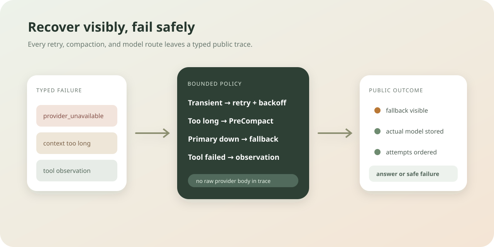

# Chapter 8: Error Recovery and Fallback

Language: [Chinese](./ch08-error-recovery-and-fallback.md) | English

Previous: [Chapter 7: Context Compression](./ch07-context-compression.en.md)

Next: [Chapter 9: Skills / Procedural Memory](../skills/roadmap.md#chapter-9---skills--procedural-memory)

Roadmap: [Klara Roadmap](../skills/roadmap.md)

---

## Understand This Chapter in One Sentence

Klara classifies model failures, retries only transient provider faults with bounded backoff, compacts once after a context rejection, and records an explicit primary-to-fallback route without publishing the provider response body.



| Failure | Runtime action |
| --- | --- |
| Timeout, rate limit, transport fault, or 5xx | Retry the same candidate up to the frozen attempt budget |
| Prompt exceeds the provider context window | Run `PreCompact`, tighten the transcript budget, rebuild the system prompt, and retry once |
| Candidate remains unavailable | Continue to the next configured fallback and record both model refs |
| Authentication or request rejection | Fail immediately with a typed safe error |
| Tool raises or is unknown | Return a failed model-visible observation and continue the bounded loop |

## Quick Experience

Start the local product:

```powershell
.\scripts\dev.ps1
```

When the primary provider fails and a fallback succeeds, the chat shows `Fallback active · primary → fallback`. A prompt recovery shows `Prompt recovered · context compacted`. The developer trace retains the ordered attempts and error codes, while the user conversation receives an answer or a short safe failure message.

## Why `try/except` Is Not a Recovery Policy

A generic retry may repeat authentication failures, send an already oversized prompt again, hide a fallback model change, or leak a provider response body into UI events. Chapter 8 separates three responsibilities:

```text
OpenAI-compatible adapter -> classify one provider candidate
Routed client             -> choose and expose candidate order
Core loop                 -> recover context and preserve lifecycle order
```

`ModelCallError` is defined in core so the loop can recover without importing provider infrastructure. Its public fields are `code`, `retryable`, `status_code`, and trace-safe runtime events. The exception message is not treated as public data.

## Mechanism One: Retry Only Transient Failures

HTTP 408, 429, 500, 502, 503, and 504 are retryable. Transport errors and timeouts are retryable. Authentication, an ordinary rejected request, an invalid response, and context overflow are not retried inside the HTTP adapter.

The frozen policy exposes attempt count, base delay, maximum delay, and an optional timeout. By default no provider read timeout is imposed because thinking calls can be long; an operator may set `KLARA_PROVIDER_TIMEOUT_SECONDS` without changing source.

<details>
<summary>Inspect the provider policy and fault tests</summary>

```text
config/runtime.toml
src/klara/infra/config/runtime.py
src/klara/infra/llm/openai_compatible.py
tests/klara/infra/llm/test_openai_compatible.py
```

Tests inject HTTP errors, replace sleep with a recorder, and assert the exact event order. The provider body contains a private marker that must be absent from events and error strings.

</details>

## Mechanism Two: Context Overflow Returns to the Context Owner

The router does not switch model immediately after `context_length_exceeded`. Core first emits `model_call.failed`, starts prompt recovery, invokes the established `PreCompact` hook, and asks a capable controller to tighten its transcript budget to 70 percent.

```text
llm.started
-> model_call.failed
-> prompt_recovery.started
-> pre_compact.started / completed
-> context.prompt_recovery_applied
-> prompt_recovery.completed
-> llm.started
```

The second request rebuilds its system prompt so the new private session summary is actually visible to the model. Recovery is bounded by `max_prompt_recovery_attempts`; Chapter 8 defaults to one.

## Mechanism Three: Fallback Is a Route, Not a Secret

Profiles in `config/models.toml` already define a primary and ordered fallbacks. `RoutedLlmClient` now emits candidate start/failure/completion events plus `model_route.fallback_started`. `ModelResponse.model_used` records the actual model, and `llm.completed` carries both `requested_model` and `model`.

<details>
<summary>Inspect routing, API projection, and UI</summary>

```text
src/klara/infra/llm/routed_client.py
apps/api/services/run_event_projector.py
apps/web/src/components/ChatWorkspace.tsx
apps/web/src/components/ProviderRecoveryStatus.test.tsx
```

The recovery banner uses only persisted SSE events. It does not infer provider state from prose, and it renders nothing when no recovery occurred.

</details>

## Mechanism Four: Public Failure Evidence Has a Hard Boundary

Provider attempt events contain provider id, model ref, attempt number, error code, retryability, status code, and delay. They never contain response bodies, request prompts, credentials, headers, or exception strings. The API maps typed failures to a small user-safe message while preserving the code for support and evaluation.

Tool failures keep the Chapter 2 observation contract: the assistant receives `ToolResult(ok=False)` and can explain the limitation. A failure does not become an invented success, and one broken tool does not crash the loop before the model can respond.

## Run and Verify

```powershell
$env:PYTHONPATH = "src;."
python -m klara.eval.chapter08_cli `
  --repository-root . `
  --json-out docs/reports/product/ch08-provider-recovery.json `
  --markdown-out docs/reports/product/ch08-provider-recovery.md `
  --markdown-en-out docs/reports/product/ch08-provider-recovery.en.md
python -m pytest -q
Push-Location apps/web
npm test
npm run build
Pop-Location
```

The deterministic gate injects a 503 followed by success, a primary candidate failure followed by fallback, one context-length rejection followed by compaction, and an unknown tool. It checks 18 contracts without calling a paid provider.

## Small Experiments

1. Change retry attempts to one and confirm no `provider.retry_scheduled` event appears.
2. Inject HTTP 401 and confirm the adapter fails immediately without sleeping or selecting the same candidate again.
3. Set prompt recovery attempts to zero and confirm context overflow ends in a typed safe failure.
4. Add a second fallback and confirm candidate indices and the actual completion model remain ordered.

## Chapter Boundary and Next Chapter

This chapter provides deterministic recovery mechanics, not provider health scoring, incident response, circuit breakers across processes, or a learned route selector. Chapter 9 adds progressively disclosed procedural Skills; production queues and multi-worker recovery arrive later in the roadmap.
