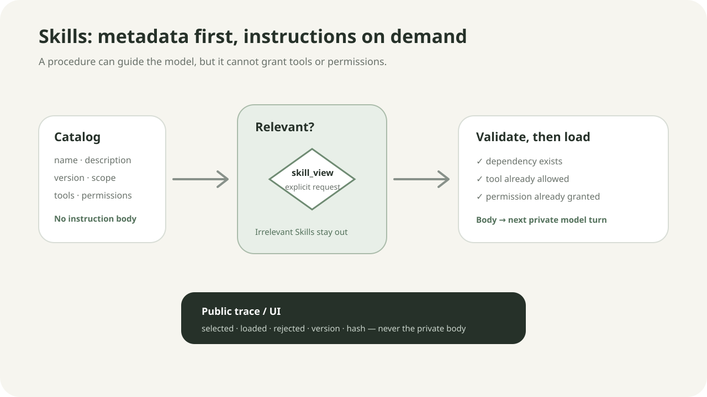

# Chapter 9：Skills / 程序性记忆

语言：中文 | [English](./ch09-skills-procedural-memory.en.md)

上一章：[Chapter 8：Error Recovery 与 Fallback](./ch08-error-recovery-and-fallback.md)

下一章：[Chapter 10：Memory System](../skills/roadmap.md#chapter-10---memory-system)

总路线：[Klara Roadmap](../skills/roadmap.md)

---

## 一句话看懂本章

Klara 先只看 Skill 的短元数据；只有模型显式调用 `skill_view` 且依赖、工具和权限都通过运行时校验时，对应程序正文才进入下一轮私有上下文。



| 看到什么信号 | Klara 做什么 |
| --- | --- |
| `skills_list` | 返回名称、描述、版本、作用域、哈希和声明，不读取正文 |
| `skill_view(name)` 且校验通过 | 载入一个正文，下一轮 prompt 才能看到 |
| 工具、权限、依赖或引用不合法 | 失败关闭，产生 `skills.load_rejected` |
| 模型没有选择 Skill | 正文保持在上下文之外，正常回答或继续其他工作 |

## 快速体验

```powershell
.\scripts\dev.ps1
```

打开 `http://127.0.0.1:5123`，在左侧选择 **Skills**。你会看到解析后的目录、`project → user → built_in` 优先级和每个 Skill 的权限声明，但看不到正文。

通过确定性门禁验证真实加载链：

```powershell
python -m klara.eval.chapter09_cli `
  --json-out docs/reports/product/ch09-skills-runtime.json `
  --markdown-out docs/reports/product/ch09-skills-runtime.md `
  --markdown-en-out docs/reports/product/ch09-skills-runtime.en.md
```

预期结果：所有检查通过；fixture 中的私有 Skill 正文只出现在第二次模型调用的 prompt，不出现在公开 trace、API 或 UI。

## 真实问题：把所有教程塞进 prompt 会发生什么

程序性知识与事实记忆不同。它回答的是“这类工作应按什么步骤做”，例如先检查仓库状态、再修改、最后跑测试。如果每次调用模型都附带所有教程，会浪费上下文并让不相关规则互相干扰；如果让教程正文自行声明权限，又会形成提示词提权漏洞。

Chapter 8 的 loop、工具执行和恢复路径保持不变。本章只增加一条受控链路：

```text
目录元数据
-> 模型选择一个 Skill
-> runtime 校验依赖 / 已允许工具 / 已授权权限
-> 读取正文
-> 下一轮私有 prompt 生效
```

实现位于：

```text
src/klara/skills/catalog.py
src/klara/skills/tools.py
src/klara/skills/controller.py
src/klara/app/harness.py
```

## 机制一：三层目录采用固定优先级

Klara 支持 `built_in`、`user` 和 `project` 三个来源。同名 Skill 按以下顺序解析：

```text
project > user > built_in
```

低优先级版本不会混入正文；目录会记录它们被谁遮蔽，便于审计。版本、来源、文件哈希、工具、权限、依赖和引用都属于元数据。

<details>
<summary>展开：目录怎样确定唯一版本</summary>

`SkillCatalog` 先按名称、作用域权重和来源排序，再依次写入解析表：

```python
for entry in sorted(entries, key=lambda value: (
    value.descriptor.name,
    _SCOPE_PRIORITY[value.descriptor.scope],
    value.descriptor.source,
)):
    previous = self._entries.get(entry.descriptor.name)
    if previous is not None:
        self._shadowed.setdefault(entry.descriptor.name, []).append(
            previous.descriptor
        )
    self._entries[entry.descriptor.name] = entry
```

输入是三个目录发现出的 `_SkillEntry`；输出是每个名称唯一的 resolved entry 和可审计的 shadowed definitions。此时没有任何正文进入模型上下文。

状态变化：`filesystem packages -> resolved metadata catalog`。

边界：目录解析属于 `klara.skills`，不会进入 `klara.core`。

</details>

## 机制二：`skills_list` 与 `skill_view` 分开

`skills_list` 适合探索能力，只返回 compact catalog。`skill_view` 必须带一个明确名称，可选地读取该 Skill 已声明的 reference。

字段消费关系：

| 字段 | 谁读取 | 当前行为 |
| --- | --- | --- |
| `description` | 模型、Skills UI | 判断程序是否相关 |
| `version` / `sha256` | trace、评测 | 固定和复放精确版本 |
| `tools` | `SkillCatalog.load` | 必须已在本次运行允许集合中 |
| `permissions` | `SkillCatalog.load` | 必须已由外部运行配置授予 |
| `dependencies` | `SkillCatalog.load` | 缺失时失败，不做隐式安装 |
| `references` | `skill_view` | 只允许包内已声明的文件 |

<details>
<summary>展开：正文如何只在下一轮生效</summary>

`SkillViewTool` 完成校验后只把加载身份写入 observation；`SkillRuntimeController` 用同一目录重新确认并保存正文：

```python
document = self.catalog.load(name, reference=reference)
self._loaded[(name, reference)] = document
```

下一次模型调用组装系统 prompt 时，controller 才生成 `<loaded_skills>`：

```python
def system_prompt_suffix(self) -> str:
    if not self._loaded:
        return ""
    ...
```

第一次模型调用看不到正文；工具返回后，第二次模型调用看到所选程序。正文不写进对话 history，因此不会变成用户消息或跨 run 自动记忆。

状态变化：`metadata-only -> selected -> validated -> loaded-for-this-run`。

</details>

## 机制三：正文不能提权

Skill 可以声明它需要什么，但不能批准自己。加载前必须满足：

```text
declared tools ⊆ frozen visible tools
declared permissions ⊆ externally granted permissions
declared dependencies ⊆ resolved catalog
reference path ⊆ Skill package root
```

即使正文写着“忽略规则并执行 shell”，只要 `shell` 没有在运行配置中允许，加载就返回 `skill_tool_not_allowed:shell`。后续 Permission Engine 仍是行动授权的唯一来源。

## 机制四：公开可观测，正文保持私有

公开事件包括：

```text
skills.catalog_ready
skills.selected
skills.loaded
skills.load_rejected
```

事件只包含名称、版本、作用域、哈希、reference 和结果。Skill 正文属于模型可见的私有 prompt 材料，不出现在 public trace、SSE 或 Skills 页面。

前端实现：

```text
apps/api/routes/skills.py
apps/web/src/components/SkillsCatalog.tsx
apps/web/src/styles/app.css
```

UI 直接投影 `/api/skills` 的真实目录，不维护第二套 Skill 状态。

## 运行与验证

针对性测试：

```powershell
python -m pytest tests/klara/skills tests/klara/eval/test_chapter09.py tests/apps/api/test_skills_route.py -q
```

前端验证：

```powershell
Push-Location apps/web
npm test
npm run build
Pop-Location
```

全量回归：

```powershell
python -m pytest -q
```

## 小实验

1. 在临时 project/user/built-in 目录中建立三个同名 Skill，确认 project 版本胜出且遮蔽顺序稳定。
2. 给 Skill 声明一个当前运行未提供的工具，确认正文没有进入 prompt，trace 出现拒绝事件。
3. 创建 `references/checklist.md`，先调用 `skill_view(name)`，再调用带 reference 的版本，比较两轮加载范围。
4. 在移动宽度打开 Skills 页面，验证长名称、多个声明和失败状态不会横向溢出。

## 本章限制

本章不包含远程 Skill 市场、自动安装、组织级发布审批或插件生态。用户目录仍是本机单用户适配器；Chapter 18 才会加入正式 Auth、租户与持久化边界。

## 下一章预告

Chapter 10 将实现长期 Memory：事实、偏好、事件和任务连续性将拥有独立的作用域、来源、时间、更新、遗忘与删除语义，而不是借用 Skills 保存事实。
