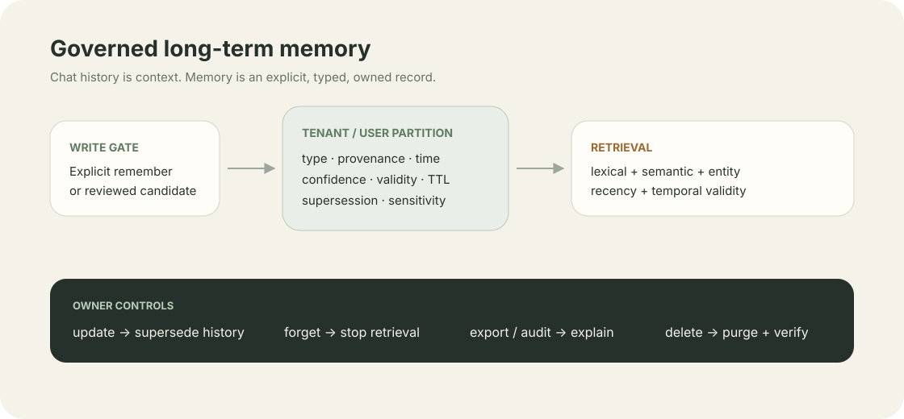

# Chapter 10: Long-term Memory System

Language: [Chinese](./ch10-memory-system.md) | English

Previous: [Chapter 9: Skills / Procedural Memory](./ch09-skills-procedural-memory.en.md)

Next: [Chapter 11: RAG As Knowledge Tool](../skills/roadmap.md#chapter-11---rag-as-knowledge-tool)

Full roadmap: [Klara Roadmap](../skills/roadmap.md)

---

## One-sentence model

Chat history is only current context. Content becomes long-term Memory only after an explicit user request or reviewed automatic candidate, and then carries tenant, type, provenance, time, confidence, and deletion semantics.



| Operation | Durable meaning | Retrieved by default |
| --- | --- | --- |
| `remember` | Create a current record | Yes |
| automatic candidate | Store in a separate review queue | No |
| `update` | Create a new record and supersede the old one | New record only |
| `forget` | Retain auditable history and stop retrieval | No |
| `delete` | Hard-delete content and retain only its audit hash | No; raw content must be absent |

## Quick start

```powershell
.\scripts\dev.ps1
```

Open `http://127.0.0.1:5123` and choose **Memory** in the sidebar. Explicitly save a preference, search by type and provenance, update it, then use forget or delete with a verified receipt.

Run the deterministic gate:

```powershell
$env:PYTHONPATH='src'
python -m klara.eval.chapter10_cli `
  --json-out docs/reports/product/ch10-memory.json `
  --markdown-out docs/reports/product/ch10-memory.md `
  --markdown-en-out docs/reports/product/ch10-memory.en.md
```

## Why chat history is not Memory

Complete chat history mixes temporary discussion, corrected facts, sensitive content, and irrelevant noise. Saving every message would make it impossible to explain why a fact exists or reliably update and delete it. Klara separates:

```text
short-term context
  messages and compacted summaries inside the current context budget

long-term memory
  structured, governable records accepted by an explicit write policy
```

`MemoryRuntimeController` publishes `ordinary_chat_saved=false` at run start. It never scans chat and writes silently. The `memory_remember` tool description also limits use to explicit remember requests.

## Five memory classes and the complete record

`MemoryKind` avoids one undifferentiated vector bucket:

```text
user_preference  user preferences
stable_fact      stable facts
episodic         events that happened
task             cross-session task continuity
agent_learning   reviewed Agent experience
```

Every `MemoryRecord` stores:

- `tenant_id`, `user_id`, and optional `agent_id` and `session_id`;
- provenance source type, actor, and source id;
- created/updated time, `valid_from`, `valid_to`, and TTL;
- confidence, sensitivity, and metadata;
- `supersedes_id`, `superseded_by_id`, and lifecycle status.

These fields let Klara distinguish “the user now prefers light mode” from “the user preferred dark mode in March” without destroying history.

## Scope must apply before retrieval

Every read, mutation, and delete in `SQLiteMemoryRepository` matches `memory_id + tenant_id + user_id`. Another tenant that guesses an id receives the same `memory_not_found` result and cannot use error differences to confirm existence.

```text
API / tool authenticated scope
  -> SQL tenant_id + user_id filter
  -> lifecycle / TTL / agent filters
  -> retrieval ranking
```

Filtering scope after ranking would already be an isolation failure.

## Updates, temporal conflicts, and historical queries

`update` does not overwrite the old fact in place. It:

1. verifies that the old record belongs to the scope and is active;
2. creates a new current record;
3. marks the old record superseded and sets `valid_to`;
4. creates bidirectional supersession links;
5. appends audit facts without content.

Normal search returns active records. Explicit `at_time` historical queries admit superseded records and use temporal validity to determine what was true then.

## Automatic candidates require review

Automatic proposals and committed Memory use separate tables. `propose_candidate` creates only a pending candidate, which never appears in search. `review_candidate(... approve=True)` can commit it; rejection hard-deletes the candidate body and retains only a content-hash audit fact.

This permits future Stop-hook proposals without allowing the model to persist every conversation by itself.

## Hybrid retrieval and inspectable ablations

The repository-native ranker combines five signals:

```text
hybrid score =
  0.30 lexical
  0.34 deterministic semantic hash-vector
  0.14 entity overlap
  0.10 recency
  0.12 temporal validity
```

Every result includes score components so retrieval and ranking failures can be separated. Chapter 10 compares the same fixture and top-k across:

- full context;
- recent window;
- lexical-only;
- vector-only;
- Klara hybrid;
- a simplified Mem0-compatible retrieval baseline.

`mem0_compatible` is only a published vector-plus-recency compatibility baseline. It is not the official Mem0 system and cannot support an “outperforms Mem0” claim.

## Mem0, MEM1, and public benchmark contract

The final fair experiment must give every system the same answer model, dataset and hidden split, maximum context, generation length, top-k, inference budget, and grader. Planned suites are:

| Benchmark | Main competency | Official source |
| --- | --- | --- |
| LoCoMo | long conversation QA, events, and multi-hop | `snap-research/locomo` |
| LongMemEval | extraction, multi-session, update, temporal, abstention | `xiaowu0162/LongMemEval` |
| MemoryAgentBench | retrieval, test-time learning, long-range understanding, conflict | `HUST-AI-HYZ/MemoryAgentBench` |
| BEAM | ten memory abilities from 128K to 10M | `mohammadtavakoli78/BEAM` |

Competitors use official execution paths: Mem0 through `mem0ai/memory-benchmarks`, and MEM1 through the official `MIT-MI/MEM1` checkpoint and rollout. Chapter 10 freezes only their adapter contracts and marks both `not_executed`. Full comparison runs after one answer model is frozen; BEAM begins at the 128K/100K scale and moves to HKU.

Reports include answer quality, retrieval recall/precision, temporal and multi-hop accuracy, tokens, P50/P95 latency, cost, and storage growth. A system that did not execute must remain unreported instead of inheriting a paper number.

## Deletion proof and the audit boundary

`delete` captures the content hash, hard-deletes the record, scans durable payloads, and returns:

```json
{
  "deleted": true,
  "raw_content_occurrences": 0,
  "deletion_verified": true
}
```

Audit storage keeps operation, owner, actor, record id, time, and `content_sha256`; it does not keep deleted text. Tests scan SQLite payloads directly and fail on one raw occurrence.

## API, tools, trace, and UI

The product API supports list/create/search/update/forget/delete. The owner sees content and provenance in the Memory manager. Normal runtime trace, SSE, and activity projections expose only memory id, kind, status, counts, and deletion proof—not the query, content, or provenance note.

`ToolResult.public_content` lets the model see authorized retrieved content within its run while JSONL trace receives a safe replacement observation. This generic core mechanism only separates model and public views of one observation; it contains no Memory business rules.

## What this chapter proves and does not prove

Passing proves real implementations and regressions for five memory kinds, scope, provenance, temporal conflicts, candidate review, TTL, update/forget/delete/export/audit, hybrid retrieval, API, safe runtime projection, and responsive UI.

It does not mean full LoCoMo, LongMemEval, MemoryAgentBench, or BEAM has executed, nor that Klara outperforms Mem0 or MEM1. Those conclusions require the unified public and hidden evaluation after the answer model freezes.

Chapter 11 general document RAG remains `deferred_by_scope`; Memory retrieval cannot be used to claim it complete. The next implementation phase is the Chapters 12–13 evidence-control runtime.
