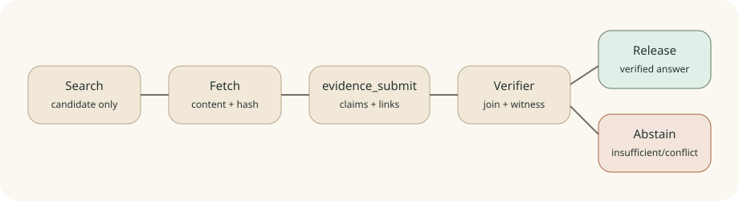

# Chapter 12: Controlled Agentic RAG

Language: [Chinese](./ch12-controlled-agentic-rag.md) | English

> This chapter wires the existing evidence structures into the real Agent final-answer path. Chapter 11 general document knowledge-base RAG remains deferred by scope. This chapter handles web-research evidence only and cannot be used to claim general RAG completion.



## Problem

A search result is not an answer. A search snippet may be truncated, stale, or inconsistent with the page body. Even after fetching a page, a model may cite a nonexistent source id, omit a required citation, or present contradicted evidence as a certain fact. The original `EvidenceController` ran only in Lab A fixtures, so it did not constrain real API runs.

The product objective is that whenever a run requires web research, its final text must first pass a claim-level evidence submission and runtime verification. If any required claim fails, the system repairs the answer or explicitly abstains instead of releasing plausible prose.

## Mechanism One: Separate Search Candidates From Evidence

`web_search` produces candidate cards with `must_fetch_before_citing=true`. Its snippet never enters `EvidencePack`. Only after `web_fetch` reads public page content does `EvidenceLedger` create a `SourceRecord` with final URL, fetch time, complete bounded content, SHA-256, quality, status, and limitations.

```text
web_search candidate
  -> web_fetch
  -> SourceRecord(content, content_hash, fetched_at, status)
  -> EvidencePack
```

Consequently, using a `cand-*` value as a `source_id` produces a dangling-source error in the real runtime, and search-only work cannot pass final-answer control.

## Mechanism Two: Structured Answer Handoff

`evidence_submit` is a side-effect-free tool. The model submits proposed final text, material claims, claim/source links, semantic judgments, exact short source witnesses, and citations. It does not publish the answer; it hands the structure to `EvidenceRuntimeController`.

The full tool result is visible only inside the current model loop. Public trace uses separate `public_content` that exposes claim/link/citation counts and the abstention flag, never final text or support notes.

<details>
<summary>Why not infer claims from Markdown links?</summary>

Markdown only shows that the model wrote a link. It cannot say which claim the link supports or express contradicted, insufficient, required, or source status. Explicit join keys are required for stable replay and scoring.

</details>

## Mechanism Three: Deterministic Final-Answer Gate

The verifier fails closed in this order:

1. claim, link, citation, and source ids must exist and be unique;
2. EvidencePack rejects duplicate source ids, canonical URLs, and content hashes;
3. a supported or contradicted link must carry an exact short witness from fetched content;
4. a required claim passes only with an admissible source, supported link, and citation;
5. contradicted, stale, irrelevant, insufficient, or dangling evidence blocks a factual answer;
6. when evidence is genuinely insufficient, explicit `abstain=true` is allowed but requires a public reason and final text.

The core loop supports `FinalAnswerDecision.replacement_content`. After verification, it releases `evidence_submit.final_text` plus a Sources list generated from fetched URLs. A later unchecked model draft never leaves the loop.

## Real Source And State Change

- `src/klara/services/evidence/runtime.py`: real LoopController, EvidencePack construction, witness checks, citation rendering, and abstention.
- `src/klara/tools/builtin/evidence_submit/`: model-visible structured handoff and trace-safe projection.
- `src/klara/core/loop.py`: combines controllers and uses controller-approved replacement content.
- `src/klara/services/web/research.py`: fetched-content hash, status, limitations, and provenance.
- `apps/api/services/run_event_projector.py`: exposes only verification status, claim judgment, and join ids.
- `apps/web/src/components/ChatWorkspace.tsx`: shows verified, blocked, or evidence-limited state without hidden reasoning.

A successful run follows this state sequence:

```text
web_research.started
-> evidence.candidate_recorded
-> evidence.source_recorded
-> evidence.answer_submitted
-> evidence.verification_completed(allowed=true)
-> final_answer.allowed
```

## Experiment And Reproduction

```powershell
$env:PYTHONPATH = "src"
python -m klara.eval.chapter12_13_cli `
  --json-out docs/reports/product/ch12-13-evidence-runtime.json `
  --markdown-out docs/reports/product/ch12-13-evidence-runtime.md `
  --markdown-en-out docs/reports/product/ch12-13-evidence-runtime.en.md
pytest -q tests/klara/services/evidence tests/klara/eval/test_gate.py
```

The critical deterministic gold gate requires Citation Precision, Citation Recall, Contradiction Recall, and Abstention Accuracy all to equal `1.0`. Real-loop tests separately cover candidate-as-source, forged witness, stale, irrelevant, contradicted, duplicate, and explicit abstention cases.

The gate also performs one bounded live fetch of `https://example.com/`. It validates only the current network path and safe fetcher; it does not enter deterministic accuracy. If external networking is unavailable, the probe remains `unavailable` and cannot rewrite the gold result.

## Limits And Next Step

A perfect deterministic fixture score is not open-domain accuracy. Semantic judgment still comes from the answer model or a future judge. The runtime verifies provenance, joins, status, citations, and exact source witnesses; it does not present lexical similarity as truth. Chapter 13 continues with bounded research, source readiness, conflict handling, and UI presentation. General document RAG remains unfinished.
