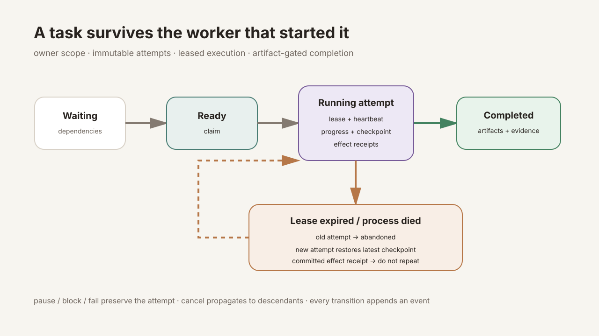

# Chapter 14：Durable Task System

语言：中文 | [English](./ch14-durable-tasks.en.md)

上一章：[Chapter 13：Research Agent](./ch13-research-agent.md)

下一章：[Chapter 15：Background Scheduler](../skills/roadmap.md#chapter-15---background-scheduler)

总路线：[Klara Roadmap](../skills/roadmap.md)

---

## 一句话看懂本章

聊天 Run 是一次可见交互，Durable Task 才是可以跨进程死亡继续、能够证明“谁在做、做到哪、做过几次、产物是否齐全”的持久化工作单元。



## 快速体验

```powershell
.\scripts\dev.ps1 -Restart
```

打开 `http://127.0.0.1:5123`，在左栏选择 **Tasks**。每次聊天 Run 会以相同 `run_id/task_id` 进入 Task Board；还可以查看状态、进度、attempt、artifact 与不可变事件历史，并对 paused/blocked/failed 状态执行 resume/retry，对非终态任务执行 cancel。

运行确定性门禁：

```powershell
$env:PYTHONPATH='src'
python -m klara.eval.chapter14_cli `
  --json-out docs/reports/product/ch14-durable-tasks.json `
  --markdown-out docs/reports/product/ch14-durable-tasks.md `
  --markdown-en-out docs/reports/product/ch14-durable-tasks.en.md
```

## 为什么 Run 状态不够

`queued/thinking/completed` 足以绘制一次聊天，但不能回答：

- 进程崩溃后由哪个 worker 接管？
- 旧 worker 复活时为何不能继续写？
- 外部动作是否已经执行，恢复时会不会重复？
- 完成所需报告或证据是否真实存在？
- pause、block、fail 后的每次尝试是否仍可审计？

因此 `RunService` 保留面向聊天的投影，同时把相同 ID 映射到 `DurableTaskService`。Task 是执行真相，聊天状态是面向用户的交互投影；它们不是两套互相竞争的 loop。

## 完整持久化合同

每个 `DurableTask` 都包含：

- `tenant_id + owner_id + agent_id` 身份分区；
- dependencies 与 parent/child lineage；
- state、progress、current step 与 block reason；
- active attempt、attempt count 和最大尝试次数；
- worker、lease 哈希、到期时间和 heartbeat；
- checkpoint sequence；
- required artifacts 与 required evidence；
- 创建、更新、完成与取消时间。

attempt、checkpoint、artifact、effect receipt 和 event 各自独立持久化。状态转移与 attempt 关闭在同一 SQLite transaction 内完成，并用 `updated_at` compare-and-swap 阻止并发 worker 覆盖。

## 状态机由代码控制，不由模型声明

```text
waiting --dependencies satisfied--> ready --claim--> running
running --pause--> paused --resume--> ready
running --block--> blocked --resume--> ready
running --fail--> failed --retry budget--> ready
running --requirements satisfied--> completed
any non-completed state --cancel--> cancelled
```

非法转移直接返回冲突。例如 running task 仍有有效 lease 时不能被第二个 worker claim；failed task 只有在 attempt budget 未耗尽时才能 retry；completed/cancelled 不会被重新执行。

## Lease、Heartbeat 与进程死亡恢复

claim 返回一次性的原始 lease token，SQLite 只保存 SHA-256。后续 progress、heartbeat、checkpoint、artifact 与终态操作必须同时满足：

1. task 仍为 running；
2. token 哈希精确匹配；
3. lease 尚未过期；
4. active attempt 仍存在且为 running。

进程死亡后，旧 lease 到期。新 worker claim 时，系统原子地把旧 attempt 关闭为 `abandoned`，创建新 attempt，并返回最新 checkpoint metadata。旧 worker 即使恢复也无法继续写。

这里实现的是通用的“过期 lease 可接管”原语。自动扫描、定时 claim、重启通知与 recurring semantics 属于 Chapter 15 Scheduler，不能在本章报告中冒充已完成。

## Checkpoint 的公开面与恢复面

checkpoint payload 会保存在 owner-scoped SQLite 内，用于恢复；单个 payload 的 canonical JSON 上限为 256 KiB，拒绝非 JSON 与 NaN 值。普通 API 只公开：

- checkpoint id、attempt id 与 sequence；
- summary；
- payload SHA-256；
-字段数量，而不是字段名或内容。

因此开发者可以验证恢复 lineage，但 Task Board 不会泄漏 secret、prompt 或 provider-private state。

## 幂等副作用收据

可能产生外部副作用的步骤必须先 `reserve_effect(task_id, idempotency_key)`。唯一键是 owner-scoped task 与 idempotency key：

```text
new key       -> reserved / should_execute=true
commit result -> committed + result_sha256
recovery call -> committed / should_execute=false
```

如果 worker 在执行动作后死亡，恢复 worker 会看到已提交收据，而不是再次发送。若进程在 reserve 后、真实副作用发生前后边界崩溃，具体工具仍须使用相同 idempotency key 对接支持幂等的外部系统；本地收据不能凭空提供跨系统 exactly-once 共识。

## Artifact / Evidence 完成门禁

创建 task 时可以声明 `required_artifacts` 与 `required_evidence`。`complete` 会查询真实 artifact 表：

- 普通 artifact 名称必须覆盖全部 required artifacts；
- `is_evidence=true` 的 artifact 才能覆盖 required evidence；
- 任意缺失都会保持 running 并返回明确冲突。

URI 公开前会移除 HTTP query/fragment；只允许 `http`、`https`、`workspace` 与 `artifact` 语义，避免把 token 携带到 UI。

## 取消传播与不可变 attempt 历史

取消 parent 会递归取消仍未终结的 descendants。正在运行的 child attempt 被关闭为 `cancelled`；旧 attempt 不被改写成新 attempt，也不会因为 retry 或 recovery 消失。Task detail 同时返回 attempt、artifact、latest checkpoint metadata 与 append-only event history。

## API、RunService 与 Task Board

`/api/tasks` 暴露 create/list/detail、claim、heartbeat、progress、checkpoint、artifact、pause、block、resume、fail、retry、complete 与 cancel。所有查询先应用 owner scope；猜中另一个租户的 task id 仍只得到 `task_not_found`。

现有 `RunService` 在创建聊天 Run 时创建同 ID task，worker thread claim 后记录启动和答复阶段进度，并在成功、失败、取消时进入对应 durable terminal state。Task Board 直接读取这些后端合同，不保存第二份生命周期真相。

## 本章验证什么，不验证什么

确定性门禁覆盖依赖、隔离、lease 伪造、进度、checkpoint 隐私、过期接管、attempt 历史、effect 去重、产物/证据门禁、pause/resume/block/fail/retry、级联取消、API、RunService 集成与 Task Board 源合同。完整 Python、前端与生产构建另行回归。

本章不声称实现分布式共识，也不声称定时 recurring task 已完成；后者必须等 Chapter 15。问题—回答一致性探针是固定的 contract control probe，不是独立人类或模型评审，更不是通用 ChatGPT 等价性证据。
