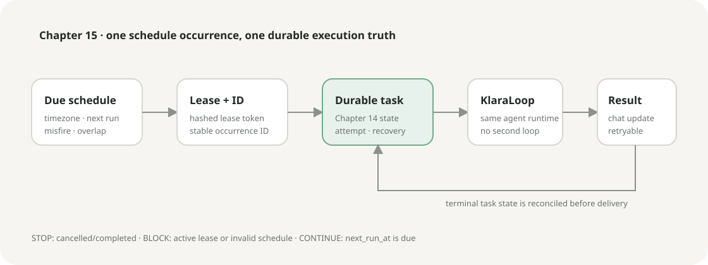

# Chapter 15: Background Scheduler

Language: [Chinese](./ch15-background-scheduler.md) | English

Previous: [Chapter 14: Durable Task System](./ch14-durable-tasks.en.md)

Next: [Chapter 16: Subagents, Teams, and Worktrees](../skills/roadmap.md#chapter-16---subagents-teams-and-worktrees)

Roadmap: [Klara Roadmap](../skills/roadmap.md)

---

## The chapter in one sentence

The Scheduler decides only when a particular occurrence should exist; execution must first become a Chapter 14 Durable Task and then enter the same `KlaraLoop`, so restart, duplicate delivery, and long-running overlap do not create a second execution truth.



| Signal | Decision | Next state |
| --- | --- | --- |
| `next_run_at <= now` and lease acquired | Generate stable occurrence ID | `reserved -> enqueued` |
| An unfinished occurrence exists | `skip` or at most `queue_one` | `skipped_overlap` |
| Misfire grace exceeded | `fire_once` or `skip` | task or `skipped_misfire` |
| Durable Task terminates | Write notification, then project it | `completed/failed/cancelled` |
| Schedule is paused/cancelled | Stop normal triggering | `paused/cancelled` |

## Quick experience

```powershell
.\scripts\dev.ps1 -Restart
```

Open `http://127.0.0.1:5123`, create a chat, then select **Scheduler** in the sidebar. Create a one-shot, interval, daily, or weekly automation; inspect timezone, recurrence, next run, last result, and occurrence history; then exercise pause, resume, run now, and cancel.

Run the deterministic gate:

```powershell
$env:PYTHONPATH='src'
python -m klara.eval.chapter15_cli `
  --json-out docs/reports/product/ch15-background-scheduler.json `
  --markdown-out docs/reports/product/ch15-background-scheduler.md `
  --markdown-en-out docs/reports/product/ch15-background-scheduler.en.md
```

The expected result is `19/19` checks, critical scheduler semantics `1.000`, and `0` public secret leaks.

## Real problem: reaching a time does not authorize running again

A naive `while sleep()` cannot answer what happens when a process dies before versus after task creation, when two workers see the same due row, which instant a nonexistent New York `02:30` or repeated `01:30` means, whether an unfinished run overlaps, or whether a notification is lost after persistence but before chat projection.

This chapter separates four durable boundaries: schedule, scheduler lease, occurrence, and notification. The model controls none of them and cannot replace database state by saying that work was scheduled.

## What stays unchanged and what this chapter adds

Unchanged: `KlaraLoop` is the only Agent loop; the Chapter 14 Durable Task remains execution state; RunService still projects Agent runs into chat; Permission, Evidence, Context, and Skills retain their existing assembly.

Added: IANA-timezone recurrence, an explicit DST policy, next-run computation, misfire and overlap handling, schedule leases, stable occurrence IDs, restart scanning, notification outbox semantics, and a Scheduler Timeline that reads the same API contract.

## From a time rule to one occurrence

`src/klara/scheduler/models.py` defines four schedule kinds, states, misfire/overlap policies, and owner scope. `_occurrence_id` in `src/klara/scheduler/service.py` uses:

```text
schedule_id | scheduled_for UTC | trigger -> SHA-256 prefix
```

When repeated ticks or a restart see the same scheduled instant, the occurrence primary key in `src/klara/scheduler/repository.py` permits one row. The flow writes `reserved`, calls `DurableTaskService.create` with a derived `task_id`, and moves to `enqueued`. If the process dies at either boundary, the next tick recovers `reserved` or redispatches an unfinished `enqueued` occurrence to the idempotent RunService.

<details>
<summary>State to follow while reading the real code</summary>

The entry point is `SchedulerService.tick`. Its inputs are owner scope, worker ID, and optional dispatcher/notifier; its output is `SchedulerTickResult`. `acquire_lease` persists only a SHA-256 of the token, then releases by token on success or error. After materialization, schedule `last_occurrence_id` and `next_run_at` advance through CAS; lease contention records no pretend execution.

Small experiment: tick the same due schedule with two workers; `tests/klara/scheduler/test_scheduler.py` asserts that only one occurrence row and one task exist.

</details>

## Recurrence and the DST decision

Daily and weekly inputs combine an IANA timezone with local `HH:MM`. `zoneinfo` round-trips wall time to real UTC instants:

- a spring-forward gap moves to the first valid local minute;
- a fall-back repetition deterministically selects the earlier fold and runs once that civil day;
- an interval advances by UTC seconds;
- a one-shot preserves the caller's timezone-aware instant.

This is an explicit product policy, not a universal calendar claim. A domain that needs to skip gaps or run twice during fall-back should add another policy rather than silently changing these semantics.

## Misfire and long-running overlap

A late time within grace executes normally. Beyond grace, `fire_once` materializes one immediate occurrence and advances from now, while `skip` writes a `skipped_misfire` audit row with no task. A tick catches up at most once to prevent a post-outage task storm.

If a schedule has an unfinished task, `skip` records the overlap only. `queue_one` also sets `queued_overlap=true`. Terminal reconciliation clears the bit and calls `run_now` once. Multiple overlaps still occupy one Boolean deferred slot.

## Pause, resume, run now, retry, and cancel

Pause retains the rule but removes it from normal due queries. Resume computes a legal next run from the current time. Run now does not alter recurring next run. A failed occurrence can retry only while its durable task has attempt budget. Cancel stops future triggers and cancels unfinished occurrence tasks; the API also asks the matching chat run to cancel.

## A notification is a recoverable projection outside model context

After a task reaches a terminal state, Scheduler first persists a deterministic notification ID. It writes `delivered_at` only after the notifier returns successfully, so a later tick retries failures. `RunService.inject_schedule_notification` writes a deterministic message ID into chat with `model_visible=False`: the user sees the completion update, but a later model call cannot mistake that system notification for a user fact.

This provides recoverable at-least-once delivery plus an idempotent projection inside the single-process database boundary. It is not exactly-once consensus across external systems.

## API, background worker, and Scheduler Timeline

`apps/api/routes/scheduler.py` exposes state/create, pause/resume/cancel/run-now, occurrence retry, and notification read. `apps/api/services/scheduler_runner.py` serializes ticks in a daemon worker managed by FastAPI startup/shutdown; execution is not performed in the request main thread.

`apps/web/src/components/SchedulerTimeline.tsx` stores no second scheduling truth. It shows real timezone, recurrence, next run, last result, queued overlap, occurrence, and notification state, and says an action was not verified on failure instead of animating optimistic success.

## Tests and evaluation

```powershell
python -m pytest tests/klara/scheduler/test_scheduler.py tests/apps/api/test_scheduler_route.py tests/klara/eval/test_chapter15.py -q
npm --prefix apps/web test -- --run src/components/SchedulerTimeline.test.tsx
npm --prefix apps/web run build
```

Coverage includes simulated time, spring gap, fall fold, misfire, overlap, pause/resume/cancel, reserved/enqueued restart, duplicate tick, notification delivery failure, scope isolation, API, and UI. The report's question/reference/candidate item is a consistency control probe, not an independent human or model judge and not evidence of general ChatGPT parity.

## Exercises

1. Add a cross-midnight weekly case to `tests/klara/scheduler/test_scheduler.py` and prove weekday uses schedule timezone rather than server timezone.
2. Throw after notification insert, rebuild `SchedulerService`, and prove projection succeeds without duplicating the chat message.
3. At 200% zoom, complete create, pause, resume, and cancel by keyboard and record focus and horizontal overflow.
4. Add an explicit UI choice for `misfire_policy` without lowering the maximum catch-up gate of one per tick.

## Limitations and next chapter

The current evidence covers one-host SQLite and one local-tenant worker, not multi-region scheduling consensus. Recovery occurs on the next application start; long provider calls remain governed by Chapter 8 and Durable Task leases. Authenticated multi-tenant workers and PostgreSQL queue/outbox belong to Chapter 18.

The next implementation stage is Chapter 17 MCP, followed by Chapter 16 bounded teams/worktrees. Both must route through Permission Engine and reuse durable task/cancellation semantics rather than add a bypass executor.
