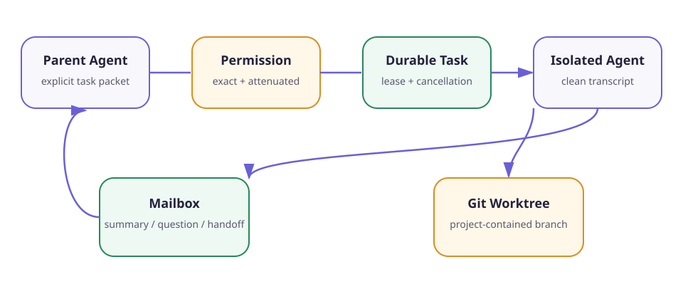

# Chapter 16: Subagents, Teams, and Worktrees

Language: [Chinese](./ch16-subagents-teams-worktrees.md) | English

Previous: [Chapter 15: Background Scheduler](./ch15-background-scheduler.en.md)

Next: [Chapter 17: MCP and External Tools](./ch17-mcp-and-external-tools.en.md)

Roadmap: [Klara Roadmap](../skills/roadmap.md)

---

## The chapter in one sentence

Klara can delegate an explicit task packet to a clean one-shot context or a persistent teammate, but creation, authority, task ownership, mailboxes, cancellation, and code worktrees remain separate durable boundaries controlled by the runtime rather than model prose.



| Boundary | What crosses it | What does not cross it |
| --- | --- | --- |
| Parent → subagent | title, instructions, allowed capabilities | parent transcript, hidden reasoning, ambient authority |
| Permission → child | same action, shorter lifetime, exact child task | wider scope, standing grant from task grant |
| Child → parent | public summary through mailbox | full internal transcript or chain-of-thought |
| Project → worktree | exact base ref and `codex/` branch | arbitrary path or shell interpolation |

## Quick experience

```powershell
.\scripts\dev.ps1 -Restart
```

Open `http://127.0.0.1:5123`, select **Team**, choose a persistent teammate or one-shot agent, and submit the bounded role/task. The first creation is blocked and appears in **Permissions**. After approving the exact action, return to Team and create it again. The UI reads real agent, mailbox, task-link, result, and worktree state.

Run the deterministic gate:

```powershell
$env:PYTHONPATH='src'
python -m klara.eval.chapter16_cli `
  --json-out docs/reports/product/ch16-subagents-team-worktree.json `
  --markdown-out docs/reports/product/ch16-subagents-team-worktree.md `
  --markdown-en-out docs/reports/product/ch16-subagents-team-worktree.en.md
```

## Why another model call is not automatically a subagent

A second LLM call becomes safe delegation only when the runtime decides what context, tools, authority, task identity, cancellation, and result are allowed. Copying the whole parent conversation silently shares irrelevant private state; sharing the parent permission scope turns delegation into privilege amplification; accepting an unbounded transcript back consumes the context budget and can reintroduce embedded instructions.

`OneShotRequest` therefore contains only title, explicit instructions, an allowlisted capability tuple, optional parent task, and model selection. `KlaraOneShotExecutor` starts `KlaraHarness` with `prior_messages=()`. It returns one `OneShotExecution.summary`; the team record stores the public summary and its SHA-256, not hidden provider reasoning.

## One-shot execution reuses Durable Task

`TeamService.spawn_one_shot` first asks Permission Engine for `team:{team_id}/spawn_one_shot`. After approval it creates a child Durable Task, saves the new agent, writes one task-assignment mailbox item, and starts a bounded worker thread. The worker claims a real Chapter 14 lease, reports progress, runs the isolated harness, completes the task, and sends one result message to the parent inbox.

Cancellation does not merely hide the card. `stop_agent` marks the agent cancelled and cancels its child Durable Task, whose existing lifecycle closes the active attempt. Executor failure is recorded as a failed task when its lease is available. There is no second task state machine.

## Persistent teammates and MessageBus semantics

A teammate is a durable identity with a name, role, allowlisted capabilities, state, and optional claimed task. Messages have sender, recipient, kind, body, task ID, monotonic recipient sequence, created time, and acknowledgement time. Reads require the exact tenant/owner/team and recipient; another owner sees an opaque not-found boundary.

The mailbox is durable communication, not shared memory. A message does not automatically modify a model prompt or grant capability. `claim_next_task` scans only tasks already assigned to that teammate's agent scope and claims through the same compare-and-swap lease used by every Durable Task worker.

## Permission bubbling means attenuation

`delegate_authority` calls the Chapter Permission Engine's existing `delegate` method. The child keeps tenant and actor, changes only to the exact child agent/task, uses the same canonical action, cannot outlive the parent, cannot delegate a consumed/denied/revoked parent, and cannot widen task authority into standing authority.

The Team runtime itself requires explicit authority for creating teammates, spawning one-shot agents, creating worktrees, and removing worktrees. The model cannot claim that permission was granted; the API returns a structured pending decision and the Team UI links to the real Permission Center.

## Worktree isolation

`TeamService.create_worktree` accepts a validated base ref and requires a `codex/` branch. The destination is generated under `<project>/.klara/worktrees/<opaque-id>` and checked after resolution. Git runs as an argument array with `shell=False`; neither branch nor path is inserted into a command string. The service records creating/ready/failed/removing/removed state and the verified HEAD SHA.

Removal is separately permissioned and refuses paths outside that exact root. It does not force-delete dirty worktrees, so uncommitted changes fail closed. Branch deletion and merge are intentionally separate future/user actions.

## API and Team workspace

`apps/api/routes/teams.py` exposes state, teammate creation, one-shot spawn, mailbox send/read/acknowledge, exact/next task claim, authority delegation, stop, and worktree create/remove. The FastAPI lifespan joins bounded child threads during shutdown.

`TeamWorkspace.tsx` has no optimistic delegation state. It shows the exact permission route, agent kind/status/capabilities, task links, summaries, parent inbox, and worktree status from `/api/teams`. Desktop and narrow layouts keep cards and long summaries inside the center rail.

## Tests and evaluation

```powershell
python -m pytest tests/klara/teams/test_team_service.py tests/apps/api/test_team_route.py tests/klara/eval/test_chapter16.py -q
npm --prefix apps/web test -- --run src/components/TeamWorkspace.test.tsx
npm --prefix apps/web run build
```

Coverage includes exact approval, clean context, summary-only return, scope opacity, mailbox cursor/acknowledgement, capability rejection, durable claiming, attenuated permission delegation, cancellation, real Git worktree creation/removal, API projection, and fail-closed UI behavior.

## Exercises

1. Add a three-member handoff and prove only the addressed mailbox receives each step.
2. Crash the one-shot worker after its first progress update and recover via the Durable Task lease.
3. Attempt a branch containing `..`, `@{`, or a leading option and verify validation occurs before Git starts.
4. Add a clean-worktree merge proposal that produces a patch artifact but still requires a separate owner decision to apply.

## Limitations and next chapter

This is a bounded single-host orchestration runtime, not a distributed worker fleet. A persistent teammate has identity, mailbox, authority, and task claiming, but no autonomous always-on polling loop. Learned routing is excluded until later evaluation and trajectory stages can compare it fairly.

Chapter 17 connects external MCP tools through the same Permission Engine and untrusted-observation boundary. Chapter 18 then replaces remaining local-only assumptions with authenticated production persistence and queue semantics.
