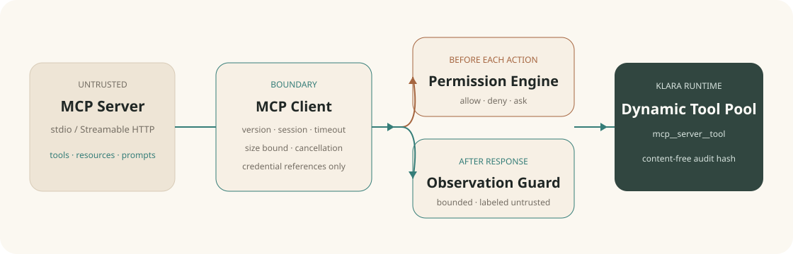

# Chapter 17：MCP 与外部工具系统

语言：中文 | [English](./ch17-mcp-and-external-tools.en.md)

上一章：[Chapter 16：Subagent、Team 与 Worktree](../skills/roadmap.md#chapter-16---subagents-teams-and-worktrees)

下一章：[Chapter 18：生产运行时与评测桥](./ch18-production-runtime-and-eval-bridge.md)

总路线：[Klara Roadmap](../skills/roadmap.md)

---

## 一句话看懂本章

Klara 可以把标准 MCP server 的 tools、resources 和 prompts 接入同一套 Agent Runtime，但“能发现”不等于“获准执行”：每次外部动作仍经过 Permission Engine，返回值按不可信数据进入模型，凭证值不写入配置、审计或公开轨迹。



## 快速体验

```powershell
.\scripts\dev.ps1 -Restart
```

打开 `http://127.0.0.1:5123`，从左栏进入 **Integrations**。可以配置：

- 本地 stdio：一个可执行命令与逐行参数；
- Streamable HTTP：一个无 URL 凭证、query 和 fragment 的 endpoint；
- 可选 credential environment name：只保存变量名，不保存值。

点击 **Connect** 会先创建一条精确权限请求。前往 **Permissions** 审批后再次连接，页面才会展示协商得到的协议版本、server 信息、tools、resources、prompts 和健康状态。

确定性门禁：

```powershell
$env:PYTHONPATH='src'
python -m klara.eval.chapter17_cli `
  --json-out docs/reports/product/ch17-mcp.json `
  --markdown-out docs/reports/product/ch17-mcp.md `
  --markdown-en-out docs/reports/product/ch17-mcp.en.md
```

## 1. 协议生命周期

`McpClient.initialize` 固定使用本阶段 manifest 中的 `2025-11-25`：先发 `initialize`，验证 server 返回的版本、capabilities 与 serverInfo，再发 `notifications/initialized`。只有 capability 存在时才读取对应目录；目录和单条 observation 都有数量/字符上限。

stdio transport 使用 `shell=False`、最小环境和独立临时工作目录。stdout 是逐行 UTF-8 JSON-RPC，stderr 独立排空，防止不可信进程填满管道后卡死。超时会发送 `notifications/cancelled`，close 依次关闭 stdin、等待、terminate、kill，并等待 reader thread 退出。

Streamable HTTP 使用 POST，并发送 JSON/SSE Accept、Origin、协议版本与可选 session ID。server 发回 `Mcp-Session-Id` 后，同一 client 的后续请求携带它；close 尝试 DELETE。每个 client 串行化 request ID 和 session 更新，避免并发响应串线。

## 2. 配置与凭证

`SQLiteMcpRepository` 按 tenant + actor 隔离配置和审计。配置可以保存 credential/environment 的**引用名称**，不能保存 bearer value。stdio 参数中出现 token、password、secret 或 API key 标记会直接拒绝；HTTP URL 中的 userinfo、query、fragment 也会拒绝。

这不是一个通用 secret manager。部署方必须把实际值放在进程环境或后续正式的 secret backend 中。Klara 只在启动 transport 的最后边界解析引用。

## 3. 权限与动态工具

连接、重连、断开、删除、ping、tool call、resource read 和 prompt get 都生成 canonical `PermissionAction`。连接等 control 动作是 critical；网络读取是 medium；未命中精确 grant 时服务抛出 `McpPermissionRequired`，API 返回 403 与 request ID，不启动进程、不发网络请求。

协商后的工具名稳定为：

```text
mcp__<server-slug>__<tool-slug>
```

同一 owner 下会拒绝产生相同 slug 的 server name。`RunService` 每次运行创建 registry 时只注入当前 owner 已连接的工具；这些工具仍走 Klara 现有的 PreToolUse Permission Hook。tool call 不会自动重试，因为“server 已产生副作用但 response 丢失”时重试会重复动作。

## 4. 不可信 observation 与可审计性

MCP output 对模型可见，但包装为 `untrusted_external_mcp`，明确要求只能当数据，不能当 system/developer instruction。单次返回和模型 observation 都有上限。

公开 trace 使用单独的 `public_content`，只显示外部 observation 已被隐藏；审计只保存 target、结果 hash、耗时、outcome 和公开错误，不保存 tool result、resource 内容或 prompt 内容。`ToolExecutor` 在修正 tool call ID 和截断内容时也保留这个公开脱敏字段。

## 5. UI 与真实状态

Integrations 页面只读取 `/api/mcp` 真状态，不制造“已连接”假象。每个 server card 展示 status、last error、catalog 与 lifecycle actions；被权限系统拦截后会明确说明“没有执行”，并提供跳转 Permissions 的按钮。桌面为三栏，窄屏收为单栏，capability 名称与 endpoint 都可换行/截断而不制造水平溢出。

## 6. 失败、恢复与边界

- timeout/malformed/oversized/version mismatch：fail closed，state 进入 degraded/error；
- API 进程退出：lifespan 调用 `McpService.shutdown`，关闭全部 child/session；配置仍保留，重启后默认 disconnected；
- reconnect 是显式用户动作并重新经过权限，不会隐式重放 tool call；
- 本章不实现 OAuth authorization server、resource subscriptions、roots/sampling/elicitation、公共 marketplace 或 experimental MCP tasks。

这些边界是刻意冻结的。Chapter 18 会在认证、多用户、队列和生产 worker 上继续加固；不会在本章偷偷扩大外部权限。
