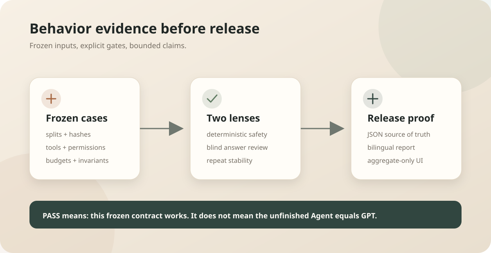

# Chapter 18: Production Runtime and Evaluation Bridge — Freeze the Agent Contract First

Language: [Chinese](./ch18-production-runtime-and-eval-bridge.md) | English

Previous: [Chapter 17: MCP and External Tools](../skills/roadmap.md#chapter-17---mcp-and-external-tools)

Next: [Lab A: Trace Dataset and Evaluation](../skills/roadmap.md#lab-a---trace-dataset-and-evaluation)

Roadmap: [Klara Roadmap](../skills/roadmap.md)

---

## Understand This Chapter in One Sentence

Klara freezes cases, permissions, budgets, and scoring rules before a candidate runs, then publishes machine-readable evidence where no critical safety failure can be hidden by an average.



| What you see | What the gate does |
| --- | --- |
| One critical case fails once | Fail directly; averages cannot offset it |
| Ordinary task success is below `0.95` | Block stage promotion |
| P0 is greater than `0` | Block release |
| The contract control probe passes | Prove only that evaluation plumbing works, not that the Agent is complete |

## Quick Experience

Run from the repository root:

```powershell
$env:PYTHONPATH = "src;."
python -m klara.eval.behavior_cli `
  --fixture tests/fixtures/behavior/agent_behavior_cases.json `
  --config config/evaluation/agent_behavior.toml `
  --repository-root . `
  --json-out docs/reports/product/agent-eval-contract.json `
  --markdown-out docs/reports/product/agent-eval-contract.md `
  --markdown-en-out docs/reports/product/agent-eval-contract.en.md
```

You should see `passed: true` and `gate_kind: contract_control_probe`. Then run `./scripts/dev.ps1` and open **Evaluations** in the sidebar. The page shows aggregate results and split hashes, never hidden case text or blind-review identities.

## The Real Problem: Why Not Build First and Test Somehow Later

If scoring rules move after candidate results arrive, failures can be reinterpreted. If every score is averaged, many easy successes can conceal a permission violation. If the UI exposes hidden cases, later implementation can optimize toward the test wording by accident.

This stage therefore completes the Phase 0B evaluation contract first. It is not a claim that Chapter 18 is finished: real trajectory export, candidate-Agent takeover, production authentication, and remote training remain later work.

## Mechanism One: Freeze Inputs, Not Conclusions

`agent_behavior_cases.json` stores source, license, split, risk, tools, permissions, expected states, forbidden actions, budgets, and the public reference answer for every behavior case. `KlaraBehaviorCase` rejects duplicate IDs, contradictory actions, and one scenario family crossing splits.

<details>
<summary>Inspect the real schema and split isolation</summary>

```text
src/klara/eval/behavior.py
tests/fixtures/behavior/agent_behavior_cases.json
config/evaluation/agent_behavior.toml
```

`stable_hash` uses stable Unicode JSON serialization. The report stores the whole fixture SHA-256 and separate hashes for development, validation, hidden regression, and adversarial splits.

</details>

## Mechanism Two: Score Deterministic Safety Separately from Answer Quality

`score_observation` checks required calls, forbidden calls, states, artifacts, invariants, prohibited claims, and step/token/cost/latency budgets. Critical cases repeat five times and ordinary cases repeat three times. P0 must remain zero and critical deterministic success must be `1.0`.

<details>
<summary>Inspect scoring and report aggregation</summary>

```text
src/klara/eval/behavior.py
src/klara/eval/behavior_report.py
tests/klara/eval/test_behavior_contract.py
```

Independent-judge and human-acceptance rates remain separate fields. `reference_gap` measures the frozen candidate against the reference, but a pass applies only to these cases, tools, permissions, budgets, and graders.

</details>

## Mechanism Three: A Control Probe Validates Only the Pipeline

The current CLI runs a named `contract_control_probe`. It submits each frozen reference answer as a compliant observation to validate schemas, thresholds, repetition stability, documentation checks, and blind-review queue wiring.

```text
control probe PASS -> evaluation substrate is wired correctly
candidate Agent PASS -> not measured in this phase
general GPT equivalence -> never implied
```

That boundary is written into JSON, both Markdown reports, and the frontend status card so “the evaluator works” cannot be misreported as “the product capability passed.”

## Mechanism Four: The Frontend Reads Only a Safe Projection

`/api/evaluations/summary` projects status, counts, metrics, checks, and split hashes from the JSON report. It does not return `case_scores` or `human_review_queue`. The frontend has loading, no-report, failure, and pass states with responsive and dark-mode treatment.

<details>
<summary>Inspect the API and visualization entry</summary>

```text
src/klara/eval/catalog.py
apps/api/routes/evaluations.py
apps/web/src/components/EvaluationDashboard.tsx
apps/web/src/styles/app.css
```

The evaluation page is an observation surface, not an evaluation calculator. The JSON report remains the single source of truth.

</details>

## Run and Verify

```powershell
python -m pytest -q
Push-Location apps/web
npm test
npm run build
Pop-Location
git diff --check
```

Focused evaluation tests also cover schema rejection, split leakage, critical failures that cannot average away, blind-review slot assignment, bilingual document structure, and hidden API fields.

## Small Experiments

1. Add one item to `p0_failures` in a temporary copy of a critical control observation and confirm that the whole gate fails.
2. Put one `scenario_family` in two splits and confirm that the fixture cannot load.
3. Temporarily remove the report and confirm that Evaluations shows `not_run` instead of inventing a zero score.

## Stage Boundary and Next Step

Phase 0B delivers a reusable evaluation contract and aggregate evidence surface. The next product branch returns to Chapter 4 for harness/config; every later chapter must connect the real Agent candidate to this frozen contract and pass before promotion. HKU, Slurm, and large-model training stay disabled until the local pre-HKU freeze.
