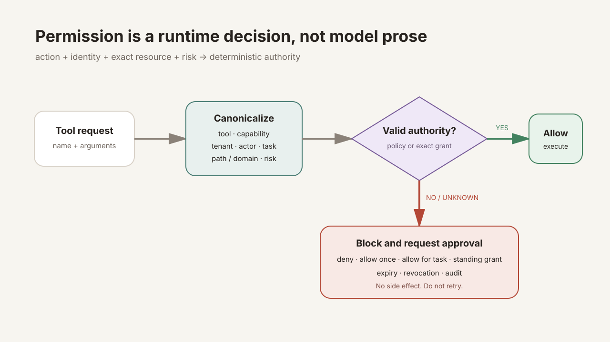

# Permission Engine: After Evidence, Before Action

Language: [Chinese](./permission-engine.md) | English

Previous: [Chapter 13: Research Agent](./ch13-research-agent.en.md)

Next: [Chapter 14: Durable Tasks](../skills/roadmap.md#chapter-14---background-tasks)

Roadmap: [Klara Roadmap](../skills/roadmap.md)

---

## The mechanism in one sentence

Before every tool execution, Klara converts the model request into identity + tool + capability + exact resource + risk + side effects; only frozen low-risk local policy or an unexpired exact grant can continue, while unknown, external, paid, control, or destructive actions stop for a user decision.



| Decision signal | Next state |
| --- | --- |
| Known low-risk, non-external local read | `allow -> tool.started` |
| Exact `allow_once`, task, or standing grant | `allow -> audit -> tool.started` |
| External, write, control, or destructive action without authority | `block -> permission.requested` |
| Unknown capability, unresolvable resource, or permission-service failure | `fail closed -> permission.denied` |
| Denial, expiry, revocation, cross-tenant access, or child escalation | `block -> no side effect` |

## Quick experience

```powershell
.\scripts\dev.ps1
```

Open `http://127.0.0.1:5123` and select **Permissions** in the sidebar. When the Agent requests `web_fetch`, image generation, deletion, or a control tool, the tool does not run first. The surface shows the tool, capability, canonical resource, risk, expiry, and repeated-request count, then offers **Deny / Allow once / Allow for task / Allow 7 days**. After approval, start the action again or let Chapter 14 Durable Tasks resume it.

Run the deterministic security gate:

```powershell
python -m klara.eval.permission_engine_cli `
  --json-out docs/reports/product/permission-engine.json `
  --markdown-out docs/reports/product/permission-engine.md `
  --markdown-en-out docs/reports/product/permission-engine.en.md
```

Expected: every check passes, `critical_isolation_and_bypass_rate = 1.0`, and raw-argument leaks equal `0`.

## The real problem: why “I have permission” from the model is not authority

Model output is untrusted advice, not an authorization source. An attack can ask it to ignore rules, use an alias tool, double-encode a URL, traverse outside the workspace, or repeat a request until something allows it. If permission lives only in a prompt, one generated sentence can change the external world.

Chapter 13's single `KlaraLoop`, tool executor, and evidence controller stay unchanged. This stage adds one deterministic chain immediately before the real tool boundary:

```text
ToolCall
-> PermissionActionResolver
-> PermissionService.evaluate
-> HookDecision
-> allow: ToolExecutor
-> block: failed observation + approval request + audit
```

Real implementation:

```text
src/klara/permissions/models.py
src/klara/permissions/resolver.py
src/klara/permissions/repository.py
src/klara/permissions/service.py
src/klara/permissions/hook.py
src/klara/app/harness.py
apps/api/routes/permissions.py
apps/web/src/components/PermissionCenter.tsx
```

## Mechanism 1: canonicalize the action before checking a grant

`PermissionActionResolver` does not accept resources that merely look similar. URLs are repeatedly decoded and normalize scheme, host, and path while dropping query data that may contain secrets. Paths resolve against the real workspace root, so `..` and symlink escapes fail. MCP binds server/tool. Shell stores only a command hash, and encoded control input is rejected.

<details>
<summary>Expand: real URL resource canonicalization</summary>

The input is the model-provided URL; the output is an authorization resource without query, fragment, or credentials:

```python
value = _fully_unquote(raw)
parsed = urlsplit(value)
if parsed.scheme.lower() not in {"http", "https"} or not parsed.hostname:
    raise PermissionResolutionError("permission_invalid_url")
if parsed.username or parsed.password:
    raise PermissionResolutionError("permission_url_credentials_forbidden")
host = parsed.hostname.encode("idna").decode("ascii").lower().rstrip(".")
normalized_path = posixpath.normpath(parsed.path or "/")
return f"{parsed.scheme.lower()}://{authority}{normalized_path}"
```

`https%3A%2F%2Fexample.com%2Fdocs` and `https://EXAMPLE.com/docs` produce the same scope. `http://127.0.0.1/admin`, userinfo URLs, and overencoded resources fail closed. Runtime state changes from a raw ToolCall to a comparable `PermissionAction`; a resolution failure creates no execution authority.

</details>

## Mechanism 2: grants bind identity, task, and resource exactly

Each request and grant stores tenant, actor, agent, optional task, tool, capability, side effect, resource type, canonical resource, risk, expiry, and argument hash. Matching requires those fields to agree. Switching tool, tenant, task, or risk cannot reuse old authority.

| effect | Usable scope | Stop signal |
| --- | --- | --- |
| `deny` | Exact action and owner | Revocation or expiry |
| `allow_once` | One atomic use of the exact action | `consumed` |
| `allow_task` | Exact task | Different task, revocation, or expiry |
| `allow_standing` | Exact tool and resource under the owner | Revocation or expiry |

<details>
<summary>Expand: grant matching and atomic once consumption</summary>

```python
if grant.scope.tenant_id != scope.tenant_id or grant.scope.actor_id != scope.actor_id:
    return False
if grant.scope.agent_id != scope.agent_id:
    return False
if grant.effect is PermissionEffect.ALLOW_TASK and grant.scope.task_id != scope.task_id:
    return False
return expected.tool_name == action.tool_name and expected.resource == action.resource
```

`allow_once` changes `remaining_uses=1` to `0` and `consumed` under a SQLite write lock and transaction. Of two concurrent calls, at most one receives authority. The other returns to approval instead of duplicating a side effect.

</details>

## Mechanism 3: child Agents can only attenuate parent authority

A child grant must preserve tenant/actor and the exact action, cannot outlive the parent, and cannot widen a task grant into a standing grant. A denied, once-only, expired, or revoked parent cannot delegate. Chapter 16 reuses this boundary instead of inventing another permission system.

## Mechanism 4: users see decision state, not raw arguments

`PermissionCenter` displays the action and canonical resource, with deny, once, task, seven-day, and revoke controls. API/SSE projects only safe fields. Raw tool arguments, prompts, queries, and `arguments_sha256` do not enter public events. SQLite audit stores action metadata and hashes, not raw arguments.

The blocked observation tells the model not to retry, preventing repeat bypass and uncanny answers:

```text
Tool blocked: explicit user approval is required. Do not retry this action unless the user grants its exact scope.
```

That matches the user's question: for a risky request, the Agent should explain the exact blocked action and wait. It must neither claim success nor secretly switch tools.

## Tests and evaluation

```powershell
python -m pytest tests/klara/permissions tests/apps/api/test_permissions_route.py tests/klara/eval/test_permission_engine.py -q
python -m pytest -q
Set-Location apps/web
npm test -- --run
npm run build
```

The security gate covers low-risk policy, external approval, deny, once, task, standing, expiry, revocation, audit, restart, tenant isolation, parent/child attenuation, concurrent once consumption, alternative tool, MCP, path traversal, symlink, private URL, encoded URL, encoded shell, and unknown capability cases.

## Exercises

1. Add a file-write fixture in `resolver.py` and prove path case or relative aliases do not widen authority.
2. Add a task-grant restart test in `test_permission_engine.py` and prove a different task remains denied.
3. Complete deny and revoke using only the keyboard in Permission Center and verify focus never leaves the dialog unexpectedly.
4. Inspect `permissions.sqlite3` and prove the test secret does not appear in plaintext.

## Limitations and the next chapter

This stage does not claim complete Shell grammar coverage; unknown syntax fails closed. When the current synchronous run is blocked, it receives a failed observation instead of waiting forever in an in-memory thread. The user must retry after approval. Durable pause/resume, leases, attempt history, and crash recovery belong to Chapter 14 Durable Tasks, which will reuse this permission system directly.
