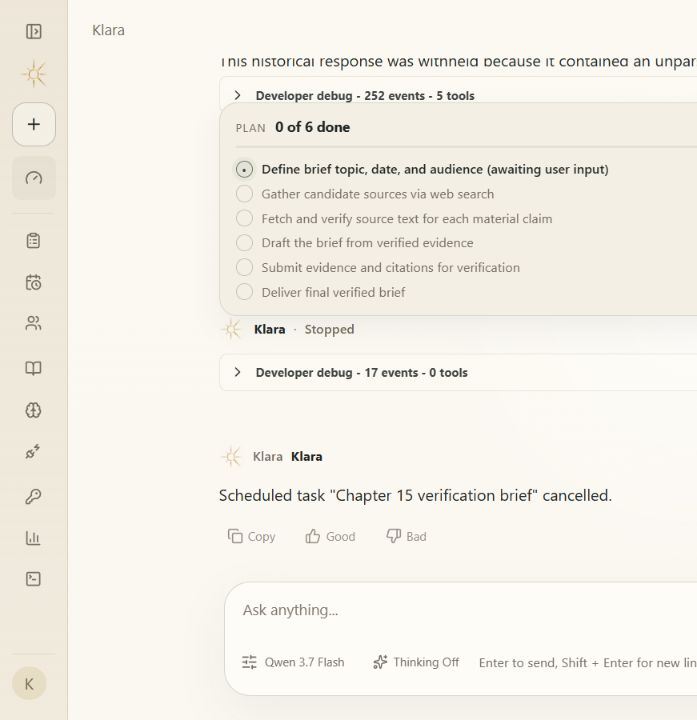

# Agent 产品打磨门禁

语言：中文 | [English](./agent-product-polish.en.md)

Status: **PASS**

机制：模型、持久层与开发者追踪数据必须先通过公共输出边界，才可以进入聊天或产品界面。



## 验收证据

- 评分器: `klara.agent-product-polish.v1`
- 检查: `15/15`
- 定向 Python 测试: `64 passed`
- 前端测试: `20 files / 71 passed`
- 修复后 P0 奇怪回答: `0`

| 检查 | 结果 |
| --- | --- |
| `browser_privacy_console_and_screenshots_pass` | PASS |
| `cancelled_run_is_not_restarted` | PASS |
| `deepseek_dsml_is_normalized` | PASS |
| `desktop_has_no_horizontal_overflow` | PASS |
| `developer_trace_is_separate_from_chat` | PASS |
| `evaluation_history_omits_hidden_cases` | PASS |
| `historical_protocol_markup_is_withheld` | PASS |
| `malformed_dsml_fails_closed` | PASS |
| `mobile_navigation_is_contained` | PASS |
| `overview_reads_current_backend_contracts` | PASS |
| `raw_jsonl_trace_is_not_returned_by_api` | PASS |
| `raw_provider_reasoning_is_not_public` | PASS |
| `run_cancelled_is_public_terminal_event` | PASS |
| `stage_manifest_exists` | PASS |
| `worktree_inspection_is_contained_and_read_only` | PASS |

## 已修复的 P0 反例

### `provider-dsml-leak`

- 现象: A DeepSeek fallback returned DSML tool markup in assistant content.
- 修复: Normalize valid DSML, reject malformed DSML, and withhold legacy protocol text at the public read boundary.
- 回归: `tests/klara/infra/llm/test_openai_compatible.py; tests/klara/app/test_harness.py; tests/apps/api/test_sessions_route.py`

### `cancel-tail-events`

- 现象: A cancelled scheduled run retained public events after run_cancelled and could be implicitly revived.
- 修复: Make cancellation terminal and require an explicit durable-task retry before restart.
- 回归: `tests/apps/api/test_run_service_history.py`

## 复现

```powershell
$env:PYTHONPATH='src'
python -m klara.eval.product_polish_cli --json-out docs/reports/product/agent-product-polish.json --markdown-out docs/reports/product/agent-product-polish.md --markdown-en-out docs/reports/product/agent-product-polish.en.md
python -m pytest -q
Set-Location apps/web
npm test -- --run
npm run build
```

## 限制与下一门禁

- This is a product-polish stage, not Agent Product Freeze.
- The frozen task set has not yet been run against the live Agent and pinned reference with an independent judge and blind human review.
- Public memory benchmarks against Mem0 and Mem1 have not yet been executed.
- A full accessibility scanner, keyboard-only matrix, 200-percent zoom matrix, long-list profile, and reconnect/offline matrix remain.
- No HKU or model-training work was started.
